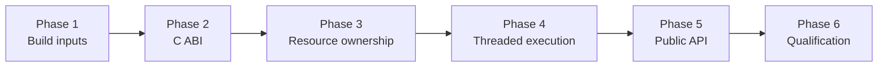

# Milestone 1 Native Foundation Implementation Plan

This plan turns Milestone 1 from an architectural contract into the smallest
safe Elixir-to-simdjson vertical slice. The completed wave builds the official
simdjson source reproducibly, contains C++ behind a private C ABI, owns parser
state through an opaque BEAM resource, runs input-dependent work outside normal
and dirty schedulers, exposes only `SimdJson.open/1` and `SimdJson.close/1`, and
replaces every Milestone 1 bootstrap exception with executed evidence.

## Source Authority

Implementation must remain consistent with these sources, in this order:

1. [Milestone 1 — Native Foundation and Opaque Document Resource](../../../docs/milestones/01-native-foundation.md)
2. Accepted architecture decisions:
   - [Native Stack and C ABI Boundary](../../decisions/0001-native-stack-and-c-abi.md) — `simd_json.native_stack_and_c_abi`
   - [Document Resource and Input Buffer Ownership](../../decisions/0002-document-resource-and-buffer-ownership.md) — `simd_json.document_resource_and_buffer_ownership`
   - [Off-Scheduler Native Execution](../../decisions/0003-off-scheduler-native-execution.md) — `simd_json.off_scheduler_native_execution`
3. Current-truth specifications:
   - [Native Build and ABI](../../specs/native_build_and_abi.spec.md)
   - [Document Resource](../../specs/document_resource.spec.md)
   - [Native Execution](../../specs/native_execution.spec.md)
   - [Document API and Errors](../../specs/document_api.spec.md)

If implementation reveals that one of these contracts cannot be satisfied, the
work stops at that boundary and the relevant ADR or spec is reconciled before
code proceeds. A task may not silently weaken a decision in order to pass its
tests.

## Phase Order

1. [Phase 1 — Reproducible Native Build Baseline](./phase-01-reproducible-native-build-baseline.md)
2. [Phase 2 — Exception-Safe C ABI](./phase-02-exception-safe-c-abi.md)
3. [Phase 3 — Zig Resource and Padded Input Ownership](./phase-03-zig-resource-and-padded-input-ownership.md)
4. [Phase 4 — Threaded Execution and Safe Teardown](./phase-04-threaded-execution-and-safe-teardown.md)
5. [Phase 5 — Public Document API and Stable Errors](./phase-05-public-document-api-and-stable-errors.md)
6. [Phase 6 — Qualification and Milestone Activation](./phase-06-qualification-and-milestone-activation.md)

Each phase consumes the verified output of the preceding phase. Later-phase
tests may extend earlier fixtures, but an earlier safety gate is not deferred
merely because the final acceptance phase repeats it.

## Contract Ownership by Phase

| Phase | Primary contract responsibility |
| --- | --- |
| 1 | Immutable toolchain and simdjson inputs, offline clean-checkout builds, provenance, licensing, target gating, and the initial CPU-dispatch matrix. |
| 2 | The opaque C header, stable status vocabulary, C++ exception containment, partial-failure cleanup, symbol visibility, and independent native conformance. |
| 3 | Zig C interop, aligned padded copies, logical-length separation, opaque BEAM resource state, lifecycle primitives, parent retention, and test-only allocation accounting. |
| 4 | Zigler threaded admission, request correlation, resource retention, cancellation boundaries, no scheduler fallback, explicit and GC teardown, shutdown, and unload safety. |
| 5 | `SimdJson.open/1`, `SimdJson.close/1`, opaque document inspection, structured errors, owner enforcement, deterministic close, input corpora, and the narrow Milestone 1 public surface. |
| 6 | Supported-target CI, sanitizers, scheduler-latency qualification, native memory baseline, reload stress, documentation, full-suite evidence, and spec activation. |

The phase documents name the exact requirement and scenario identifiers they
own. Phase 6 reconciles those identifiers against the generated SpecLed state;
no requirement is considered implemented solely because it appears in this
plan.

## Shared Conventions

- Checklist numbering:
  - phases: `N`;
  - sections: `N.M`;
  - tasks: `N.M.K`;
  - subtasks: `N.M.K.L`.
- Phase numbering begins at 1, and every child number begins with its phase
  number.
- Every phase, section, and task starts with a short description before its
  children.
- Every phase file ends with a `Phase N Integration Tests` section.
- Checkboxes remain unchecked (`- [ ]`) until implementation and the named
  evidence both exist.
- A phase is complete only when all of its tasks and integration tests pass;
  compiling successfully is never sufficient evidence for native safety.
- Test-only failure injection, allocation counters, and diagnostics must be
  compile-time gated, bounded, redacted, and absent from the release API.
- Commands and target names in this plan describe the required evidence. Their
  final repository paths may be adjusted during implementation, but the owning
  contract and test obligation may not be dropped.

## Fixed Boundaries

- Native calls flow only through Elixir → Zigler → Zig → private C ABI → C++
  shim → official simdjson.
- simdjson source is vendored from an immutable official release and verified
  without relying on an ambient system installation or a build-time download.
- Milestone 1 always uses an owned aligned padded copy. It has no zero-copy mode.
- Input-dependent parsing and potentially large cleanup never execute as an
  ordinary NIF or use dirty CPU schedulers as the library's work queue.
- A document has one owning process and no ownership-transfer API.
- Owner `close/1` returns only after native cleanup is complete; GC cleanup may
  enqueue work and return while retained metadata keeps that work safe.
- The only public Milestone 1 behavior is opening and closing an opaque
  document with structured errors.
- The threaded mechanism is a qualification runtime. Production admission
  control, the bounded worker pool, backpressure, telemetry, projection,
  streaming, and eager decode belong to later milestones.

## Evidence and Spec Activation Rules

- Each phase records focused command output or CI artifacts alongside the code
  change that produced it.
- Native test suites must exercise both release and sanitizer configurations
  where the phase calls for them.
- Scheduler evidence records the runtime, operating system, architecture,
  scheduler counts, fixture sizes, concurrency, sample count, and latency
  budget so results are reproducible.
- Test hooks prove allocation and destruction behavior but never become public
  package functions or reveal addresses or JSON content.
- Bootstrap exceptions stay in the four specs until Phase 6 confirms every
  listed closure proof. They are removed in the same change that activates the
  corresponding subject and links its executed verification.
- `mix spec.next` is run after every phase changes code, tests, or docs. The
  reported base is then used for `mix spec.check` before the phase is marked
  complete.

## Exit Criteria

- A clean checkout builds a release NIF from recorded, immutable inputs on each
  supported target and rejects unqualified targets explicitly.
- Independent native tests prove the C ABI is opaque, exception-safe,
  sanitizer-clean, and limited to its intended exported symbols.
- `SimdJson.open/1` accepts every valid top-level JSON value and returns stable,
  redacted errors for malformed inputs without leaking partial resources.
- Input bytes and initialized padding remain valid for the complete document
  lifetime even after the original BEAM binary becomes unreachable.
- Owner close, repeated close, GC cleanup, caller death, submission failure,
  application shutdown, and supported NIF reload all release native state
  exactly once.
- Large concurrent valid and invalid opens and closes stay within the documented
  normal-scheduler latency budget and do not turn dirty schedulers into a JSON
  queue.
- Native allocation accounting returns to baseline after explicit and GC-driven
  cleanup, with AddressSanitizer and UndefinedBehaviorSanitizer clean.
- The release API contains no projection, streaming, eager decode, ownership
  transfer, cursor, or raw native-handle surface.
- All four Milestone 1 specs are active with their bootstrap exceptions removed,
  `mix spec.check` reports no errors or warnings, and the full test suite passes.
