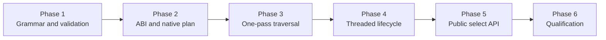

# Milestone 2 Projection API Implementation Plan

<!-- covers: simd_json.package.documentation_layout -->

This plan turns the accepted Milestone 2 projection contracts into the
library's first selective JSON operation. The completed wave validates an exact
caller projection, compiles shared paths into a private native plan, traverses
the complete JSON source once in document order, constructs only selected
scalar BEAM values, applies deterministic one-shot document semantics, and
qualifies the result against Jason full materialization without weakening any
Milestone 1 safety guarantee.

## Source Authority

Implementation must remain consistent with these sources, in this order:

1. [Milestone 2 — Projection with `SimdJson.select/2`](../../../docs/milestones/02-projection-api.md)
2. Accepted Milestone 2 architecture decisions:
   - [Projection API and Validation Contract](../../decisions/0004-projection-api-and-validation-contract.md) — `simd_json.projection_api_and_validation`
   - [Prefix-Sharing Native Projection Engine](../../decisions/0005-prefix-sharing-native-projection-engine.md) — `simd_json.prefix_sharing_projection_engine`
   - [Projection Admission, Consumption, and Lifetime](../../decisions/0006-projection-admission-consumption-and-lifetime.md) — `simd_json.projection_admission_consumption_and_lifetime`
3. Accepted Milestone 1 decisions that remain in force:
   - [Native Stack and C ABI Boundary](../../decisions/0001-native-stack-and-c-abi.md)
   - [Document Resource and Input Buffer Ownership](../../decisions/0002-document-resource-and-buffer-ownership.md)
   - [Off-Scheduler Native Execution](../../decisions/0003-off-scheduler-native-execution.md)
4. Planned Milestone 2 current-truth specifications:
   - [Projection API](../../specs/projection_api.spec.md)
   - [Projection Engine](../../specs/projection_engine.spec.md)
   - [Projection Execution and Lifecycle](../../specs/projection_execution.spec.md)
5. Active Milestone 1 specifications whose contracts must continue to pass:
   - [Native Build and ABI](../../specs/native_build_and_abi.spec.md)
   - [Document Resource](../../specs/document_resource.spec.md)
   - [Native Execution](../../specs/native_execution.spec.md)
   - [Document API and Errors](../../specs/document_api.spec.md)

The supporting architecture and Jason analysis remain non-normative design
context. If implementation reveals that an accepted decision or current-truth
requirement cannot be satisfied, work stops at that boundary and reconciles the
ADR or spec before code proceeds. A task may not weaken Milestone 1 ownership,
exception, scheduler, or cleanup guarantees in order to make projection pass.

## Phase Order

1. [Phase 1 — Projection Contract and Preflight Validation](./phase-01-projection-contract-and-preflight-validation.md)
2. [Phase 2 — ABI v2 and Native Projection Plan](./phase-02-abi-v2-and-native-projection-plan.md)
3. [Phase 3 — Single-Pass Traversal and Typed Results](./phase-03-single-pass-traversal-and-typed-results.md)
4. [Phase 4 — Threaded Projection and Document Consumption](./phase-04-threaded-projection-and-document-consumption.md)
5. [Phase 5 — Public Select API and Stable Errors](./phase-05-public-select-api-and-stable-errors.md)
6. [Phase 6 — Qualification, Benchmarks, and Activation](./phase-06-qualification-benchmarks-and-activation.md)

Each phase consumes the executed evidence of the previous phase. Later phases
may extend earlier fixtures, but native conformance, failure cleanup, and
scheduler gates are not deferred merely because Phase 6 repeats the complete
matrix.

## Contract Ownership by Phase

| Phase | Primary contract responsibility |
| --- | --- |
| 1 | Exact projection grammar, complete preflight validation, output-key identity, atom safety, error vocabulary, and normalized internal representation. |
| 2 | Private ABI version 2, fixed descriptors, opaque plan ownership, prefix-sharing construction, stable projection statuses, symbol policy, and independent C/Zig conformance. |
| 3 | Document-order object and array traversal, shared-prefix evaluation, full-source validation, duplicate-key policy, scalar slots, transactional failure, and internal phase timing. |
| 4 | Correlated threaded execution, binary temporary-document lifetime, owner-first document admission, fresh/selecting/consumed state, cancellation, close interlock, retention, and result conversion. |
| 5 | Public `SimdJson.select/2`, binary/document dispatch, exact result maps, structured path errors, documentation, active-contract reconciliation, and deferred-surface enforcement. |
| 6 | Release ABI requalification, sanitizers, lifecycle and scheduler stress, end-to-end Jason comparison, allocation acceptance, documentation, and activation of all Milestone 2 specs. |

## Shared Conventions

- Checklist numbering:
  - phases: `N`;
  - sections: `N.M`;
  - tasks: `N.M.K`;
  - subtasks: `N.M.K.L`.
- Phase numbering begins at 1, and every child number begins with its phase
  number.
- Every phase, section, and task starts with a description before its children.
- Every phase file ends with a `Phase N Integration Tests` section.
- Checkboxes remain unchecked (`- [ ]`) until implementation and the named
  evidence both exist.
- A phase is complete only when every task and integration test passes through
  the real layer owned by that phase; compiling or satisfying a policy grep is
  not behavioral proof.
- Test-only allocation, traversal, slot, boundary, cancellation, and timing
  diagnostics are compile-time gated, bounded, redacted, and absent from the
  release API and release strings.
- Exact file paths and helper names may change during implementation, but the
  owning requirement, failure path, and evidence obligation may not be dropped.

## Fixed Boundaries

- Native calls continue to flow only through Elixir → Zigler → Zig → private C
  ABI → C++ shim → official simdjson.
- Projection preflight accepts only the grammar in ADR 0004. No permissive map,
  JSONPath, wildcard, optional-field, container-materialization, or atomization
  shortcut is added.
- One public selection is one correlated off-scheduler operation and one
  terminal result; there is no NIF call per path, segment, or field.
- The native plan is operation-scoped and private. Public compiled projections
  are deferred.
- A successful selection validates the complete logical JSON input while
  constructing BEAM terms only for requested scalar leaves.
- A document is single-owner and one-shot for projection. Once native cursor
  access begins, success and failure both consume it; validation and proven
  pre-worker rejection do not.
- Binary selection owns and destroys an unpublished temporary document within
  its single operation.
- Selected strings are fresh binaries and never retain document input.
- The first repeated JSON object key in document order satisfies a requested
  path.
- The Milestone 1 Zigler-threaded runtime remains pre-production; the bounded
  worker pool, admission queue, backpressure, and telemetry remain Milestone 4.

## Evidence and Spec Activation Rules

- The three new specs remain `planned` and retain their complete Milestone 2
  bootstrap exceptions until Phase 6 executes every named closure proof.
- Earlier phases add focused verification and evidence inventory candidates but
  do not activate a partially qualified subject.
- Phase 5 reconciles active Milestone 1 scope statements that deliberately
  excluded projection; it does not rewrite history or weaken the still-active
  open/close contracts.
- Phase 6 removes each bootstrap exception in the same change that marks its
  subject `active`, sets the required executed verification strength, and links
  one or more real qualification commands covering every requirement and
  scenario.
- Benchmark fixtures, environment, selected paths, sample policy, and
  sparse-allocation threshold are committed before accepted measurements run.
- `mix spec.next` runs after each phase changes code, tests, or documentation.
  The reported base is used for `mix spec.check` before the phase is complete.

## Exit Criteria

- `SimdJson.select/2` accepts a binary or caller-owned fresh document and
  returns one exact-key map containing all requested scalar values.
- The complete projection rejects every invalid shape before native admission,
  never creates atoms, and does not consume a document on preflight failure.
- Common prefixes and identical paths are evaluated once in a document-order
  traversal independent of declaration order.
- Malformed content anywhere in the logical input fails the whole projection,
  while large unselected containers never become BEAM maps or lists.
- Missing fields, indexes, type mismatches, numeric range failures, parse
  failures, consumed cursors, and cancellation produce stable redacted errors
  with caller-supplied paths when applicable.
- Binary temporary documents and document-source plans, slots, environments,
  and retained resources return to native baseline under success, failure,
  cancellation, caller death, close, GC, shutdown, and sanitizers.
- Large concurrent projection preserves the qualified normal-scheduler budget
  without turning dirty schedulers into a queue.
- The predeclared sparse-projection benchmark demonstrates the accepted BEAM
  allocation advantage over Jason full decode plus equivalent lookups and
  reports the complete end-to-end cost.
- Public exports contain `select/2` but no compiled projection, JSONPath,
  wildcard, filter, default-field, container materialization, stream, cursor,
  transfer, raw-handle, or eager decode surface.
- All Milestone 1 gates still pass, all three Milestone 2 specs are active with
  no bootstrap exceptions, `mix spec.check` reports no errors or warnings, and
  the full release qualification suite passes.
