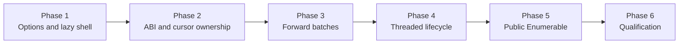

# Milestone 3 Batched Array Streaming Implementation Plan

<!-- covers: simd_json.package.documentation_layout -->

This plan turns the accepted Milestone 3 streaming contracts into a lazy,
owner-bound Elixir `Enumerable`. The completed wave will locate one root or
nested array, retain a forward-only native cursor, reuse one compiled Milestone
2 projection across its elements, return transactional row-and-byte-bounded
batches, and release all native state deterministically on completion, error,
early halt, consumer failure, or shutdown.

## Source Authority

Implementation must remain consistent with these sources, in this order:

1. [Milestone 3 — Batched Array Streaming](../../../docs/milestones/03-batched-array-streaming.md)
2. Accepted Milestone 3 architecture decisions:
   - [Lazy Stream API and Bounded Options](../../decisions/0007-lazy-stream-api-and-bounded-options.md) — `simd_json.lazy_stream_api_and_bounded_options`
   - [Forward-Only Batched Array Cursor](../../decisions/0008-forward-only-batched-array-cursor.md) — `simd_json.forward_only_batched_array_cursor`
   - [Stream Ownership, Backpressure, and Lifetime](../../decisions/0009-stream-ownership-backpressure-and-lifetime.md) — `simd_json.stream_ownership_backpressure_and_lifetime`
3. Accepted Milestone 1 and 2 decisions that remain in force:
   - [Native Stack and C ABI Boundary](../../decisions/0001-native-stack-and-c-abi.md)
   - [Document Resource and Input Buffer Ownership](../../decisions/0002-document-resource-and-buffer-ownership.md)
   - [Off-Scheduler Native Execution](../../decisions/0003-off-scheduler-native-execution.md)
   - [Projection API and Validation Contract](../../decisions/0004-projection-api-and-validation-contract.md)
   - [Prefix-Sharing Native Projection Engine](../../decisions/0005-prefix-sharing-native-projection-engine.md)
   - [Projection Admission, Consumption, and Lifetime](../../decisions/0006-projection-admission-consumption-and-lifetime.md)
4. Planned Milestone 3 current-truth specifications:
   - [Streaming API](../../specs/streaming_api.spec.md)
   - [Stream Cursor and Batch Engine](../../specs/stream_cursor.spec.md)
   - [Stream Execution and Lifecycle](../../specs/stream_execution.spec.md)
5. Active Milestone 1 and 2 specifications whose contracts must continue to pass:
   - [Native Build and ABI](../../specs/native_build_and_abi.spec.md)
   - [Document Resource](../../specs/document_resource.spec.md)
   - [Native Execution](../../specs/native_execution.spec.md)
   - [Document API and Errors](../../specs/document_api.spec.md)
   - [Projection API](../../specs/projection_api.spec.md)
   - [Projection Engine](../../specs/projection_engine.spec.md)
   - [Projection Execution and Lifecycle](../../specs/projection_execution.spec.md)

The architecture and Jason research remain non-normative design context. If
implementation shows that an accepted decision or requirement cannot be met,
work stops and reconciles that source before code proceeds. A streaming phase
may not weaken earlier ABI, projection, atom, ownership, scheduler, error, or
cleanup guarantees to make an Enumerable appear functional.

## Phase Order

1. [Phase 1 — Stream Contract and Preflight Options](./phase-01-stream-contract-and-preflight-options.md)
2. [Phase 2 — ABI v3 and Cursor Ownership](./phase-02-abi-v3-and-cursor-ownership.md)
3. [Phase 3 — Forward-Only Array Traversal and Native Batches](./phase-03-forward-only-array-traversal-and-native-batches.md)
4. [Phase 4 — Threaded Stream Lifecycle and Backpressure](./phase-04-threaded-stream-lifecycle-and-backpressure.md)
5. [Phase 5 — Public Enumerable and Stable Errors](./phase-05-public-enumerable-and-stable-errors.md)
6. [Phase 6 — Qualification, ETL Benchmarks, and Activation](./phase-06-qualification-etl-benchmarks-and-activation.md)

Each phase consumes the executed evidence of the previous phase. Later phases
may extend fixtures, but native conformance, projection regressions, boundary
accounting, and lifecycle proof are not deferred merely because Phase 6 repeats
the complete supported-target matrix.

## Contract Ownership by Phase

| Phase | Primary contract responsibility |
| --- | --- |
| 1 | Closed stream option grammar, normalized target/fields/limits, construction laziness, owner capture, error metadata reservation, and deferred public surface. |
| 2 | Private ABI v3 layouts and statuses, opaque cursor ownership, parent retention, monotonic state primitives, Zig wrappers, symbol policy, and independent construction conformance. |
| 3 | Single target lookup, forward-only row traversal, plan reuse, row/byte bounds, atomic native batches, exact done detection, full-completion validation, indexed failures, and native cleanup. |
| 4 | Lazy threaded setup, one correlated operation per batch, binary/document graphs, select/stream exclusion, one in-flight batch, no prefetch, early-halt cancellation, close/shutdown interlock, and baseline recovery. |
| 5 | Public `SimdJson.stream/2`, opaque Enumerable behavior, row flattening, runtime exceptions, indexed paths, deterministic after-cleanup, documentation, and locked Milestone 3 surface. |
| 6 | ABI/package requalification, sanitizers, scheduler and slow-consumer stress, bounded-memory ETL comparison with Jason, operations/acceptance records, and activation of all Milestone 3 specs. |

## Shared Conventions

- Checklist numbering uses phase `N`, section `N.M`, task `N.M.K`, and subtask
  `N.M.K.L`.
- Every phase, section, and task begins with a description before its children.
- Every phase file ends with a `Phase N Integration Tests` section.
- Checkboxes remain unchecked (`- [ ]`) until implementation and the named
  executable evidence both exist.
- A phase is complete only when behavior runs through the real layer owned by
  that phase; policy grep, compilation, or a synthetic alternative engine is
  not sufficient.
- All counts, sizes, indexes, offsets, additions, and multiplications crossing
  the native boundary are checked before allocation or dereference.
- Test-only cursor, plan, batch, boundary, cancellation, failure, allocation,
  and timing diagnostics are compile-time gated, bounded, redacted, and absent
  from release symbols, strings, exports, and documentation.
- Exact helper names may change, but the owning requirement, failure boundary,
  and evidence obligation may not be removed.

## Fixed Boundaries

- Native calls continue to flow only through Elixir → Zigler → Zig → private C
  ABI → C++ shim → official simdjson.
- `stream/2` accepts a binary or genuine document plus exactly `:path`,
  `:fields`, `:batch_size`, and `:max_batch_bytes`; unknown or duplicate options
  are invalid.
- `path: []` selects a top-level array. Other target segments and every field
  projection use the accepted Milestone 2 grammar and never create atoms.
- Construction is native-lazy. Only Enumerable reduction may create, reserve,
  parse, locate, compile, or advance native state.
- One cursor locates its target once, compiles one per-row plan, advances each
  array element at most once, and never rewinds or reparses.
- One native call returns at most one bounded batch. The BEAM consumes that
  batch before another request; Milestone 3 performs no multi-batch prefetch.
- The cursor retains its parent document, and a document admits at most one
  select or stream use. Cursor access commits it to consumed on every outcome.
- Completed strings are fresh binaries. A failing in-flight batch is wholly
  discarded; earlier delivered batches remain observed.
- Full consumption validates the complete logical document. Early halt closes
  at the current cursor and intentionally does not scan the remainder.
- The Zigler-threaded runtime remains pre-production. The bounded global queue,
  worker pool, cancellation registry, and public telemetry remain Milestone 4.

## Evidence and Spec Activation Rules

- The three Milestone 3 specs remain `planned` and retain their complete
  bootstrap exceptions until Phase 6 executes every named closure proof.
- Earlier phases add focused verification and evidence inventory candidates but
  do not activate a partially implemented subject.
- Phase 5 reconciles active scope statements that deliberately excluded
  streaming; it preserves every earlier operation and qualification contract.
- Phase 6 removes each bootstrap exception in the same change that marks its
  subject `active`, requires executed verification strength, and links real
  qualification commands covering every requirement and scenario.
- ETL fixtures, consumer reduction, batch-size matrix, sample policy, memory
  accounting, and thresholds are committed before accepted measurements run.
- `mix spec.next` runs after each phase changes code, tests, or documentation.
  The reported base is used for `mix spec.check` before phase completion.

## Exit Criteria

- `SimdJson.stream/2` returns an opaque lazy Enumerable for binary and genuine
  document sources without performing native work during construction.
- Root and nested target arrays yield exact-key scalar row maps in source order
  through one compiled projection and bounded native batches.
- Batch size and encoded bytes never exceed their configured limits; an
  oversized single row fails atomically with its source index.
- Empty, partial-final, exact-boundary, and multi-batch arrays terminate without
  an extra probe, duplication, omission, or public sentinel item.
- Only the constructing process can reduce the stream; document streaming and
  selection are mutually exclusive one-shot cursor uses.
- At most one native batch and one returned batch exist per stream, and a slow
  consumer produces no prefetch, parser advancement, or unbounded mailbox
  growth.
- Mid-stream errors include a stable reason, zero-based row index, and
  validated field path when known; the failing batch yields no partial rows.
- Done, error, `Enum.take`, `Enum.find`, reducer halt, consumer exception/death,
  close, GC, and shutdown release every native object exactly once.
- Complete consumption validates the whole logical document; early halt avoids
  scanning the unconsumed remainder.
- Concurrent streams preserve scheduler responsiveness and bounded working
  memory, and the frozen ETL comparison demonstrates the accepted advantage
  over Jason full materialization on the qualified workload.
- The public surface contains `stream/2` and opaque stream types but no raw
  cursor, batch API, prefetch, transfer, checkpoint, eager decode, production
  pool controls, or telemetry.
- All Milestone 1 and 2 gates remain green, all three Milestone 3 specs are
  active without exceptions, SpecLed reports zero findings, and the full
  release qualification suite passes.
