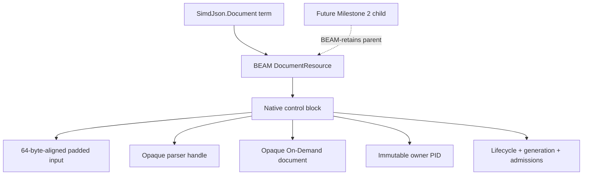
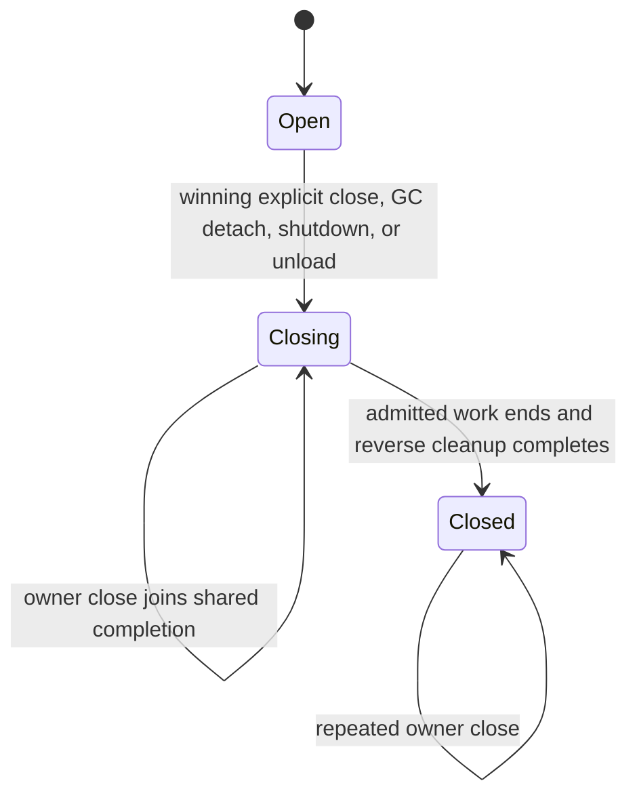

# Milestone 1 Native Foundation Operations

This guide is the implementation and maintenance companion to
[Milestone 1](./01-native-foundation.md). The accepted ADRs and active subject
specifications remain normative; this document explains how the implemented
parts fit together, how to qualify them, and which limits still apply.

## Support boundary

Milestone 1 supports one release target:

| Target | Runtime and toolchain | simdjson dispatch |
| --- | --- | --- |
| Ubuntu 24.04 LTS, `x86_64-linux-gnu`, glibc 2.39 | OTP 27.3, Elixir 1.18.4, Zigler 0.16.0, Zig 0.16.0, bundled Clang/LLVM 21.1.0 and libc++ | `haswell`, `westmere`, or `fallback`; Ice Lake is disabled by the pinned build profile |

Linux aarch64 and macOS rows are experimental, not supported. Windows, BSD,
musl, and every unlisted triple are unsupported. Build and qualification guards
fail with the detected target; they never select a system simdjson, generic
binary, alternate parser, ordinary-NIF parser, or dirty-scheduler parser.

The implementation is a pre-production qualification runtime. It proves the
ABI, ownership, cancellation, and scheduler boundaries. It does not provide a
capacity limit, backpressure, overload policy, or production telemetry. Those
belong to Milestone 4's fixed native worker pool.

## Source and package layout

| Path | Responsibility |
| --- | --- |
| `lib/simd_json.ex` | Public binary `open/1`, owner `close/1`, and private error translation. |
| `lib/simd_json/document.ex` | Opaque document wrapper and redacted inspection. |
| `lib/simd_json/error.ex` | Closed public error vocabulary and redacted inspection. |
| `lib/simd_json/native/build_guard.ex` | Target, vendor, toolchain, cache, and qualification-fingerprint guards. |
| `lib/simd_json/native/build_smoke.ex` | Zigler registration, callbacks, NIF declarations, and C++ compilation inputs. |
| `lib/simd_json/native/operation_coordinator.ex` | Stable request owner, caller monitors, correlation, cancellation, join, and orphan cleanup. |
| `lib/simd_json/native/threaded_operation.ex` | Private operation admission and Zigler-threaded adapter. |
| `native/include/simd_json_abi.h` | Canonical C11 ABI version 1. |
| `native/include/simd_json_nif_internal.h` | Hidden NIF-only extensions; never part of the shared ABI allowlist. |
| `native/src/simd_json_abi.cpp` | Single C++ exception boundary and simdjson adapter. |
| `native/zig/document_resource.zig` | Padded buffer, native handle ownership, lifecycle, generation, admission, and accounting. |
| `native/zig/build_smoke.zig` | BEAM resources, threaded workers, cleanup dispatcher, callbacks, and bounded diagnostics. |
| `native/vendor/simdjson` | Exact official v4.6.9 amalgamation, provenance, patch declaration, and upstream licenses. |
| `native/manifest.exs` | Authoritative toolchain, target, profile, cache, and qualification input matrix. |
| `native/qualification/milestone_1.exs` | Supported target, deterministic seed, commands, and expected input fingerprint. |
| `scripts/native` | Independent C, Zig, sanitizer, and release-symbol harnesses. |
| `scripts/ci` | Offline build, subject qualification, traceability, scope, and release-candidate orchestration. |

The Hex package includes `lib`, `native`, documentation, tool pins, provenance,
patch declarations, and both upstream license files. Generated Zigler source and
compiled shared objects are excluded. A consumer compiles the vendored source;
the package does not carry a generic prebuilt artifact.

## Build provenance and dependency updates

`native/manifest.exs` pins every ABI-relevant value. Compilation checks:

1. the detected target against the one supported triple;
2. Elixir and OTP against the qualified runtime;
3. Zigler's immutable Hex lock checksum;
4. Zig and its bundled Clang version;
5. every vendored file and declared patch digest;
6. the source-only build configuration before Zigler invokes Zig.

`qualification_inputs` extends this to runtime sources, harnesses, workflows,
and evidence commands. `mix simd_json.verify_qualification` computes their
canonical SHA-256 fingerprint and compares it with the Milestone 1 record. A
pin, flag, header, target, implementation, test, or command change therefore
invalidates clean-build, ABI, sanitizer, scheduler, lifecycle, package, and
scope evidence together.

For an upgrade:

1. choose immutable upstream releases and record URLs, versions, commits,
   archive checksums, and licenses;
2. reconstruct the vendor tree from the official archive plus the ordered,
   digest-bearing patch series;
3. update `.tool-versions`, `mix.exs`, `mix.lock`, and `native/manifest.exs` as
   one reviewed change;
4. run the complete release-candidate command from the same committed
   revision;
5. update the qualification fingerprint only with the new CI evidence;
6. add a supported target row only after equivalent package, ABI, sanitizer,
   dispatch, scheduler, lifecycle, and shutdown results exist.

## C ABI contract

The native layers are deliberately separated:


ABI version 1 exports four C functions from its independent shared test
artifact: parser create/destroy and document open/destroy. Handles are opaque.
Arguments are fixed-width integers, byte pointer/length/capacity triples, one
out parameter, and the fixed 16-byte status record. Both destructors accept
null. The Zigler NIF links this boundary statically and dynamically exports only
`nif_init`.

The stable status categories are:

| Native category | Public result |
| --- | --- |
| success | opaque document |
| invalid JSON | `:invalid_json` |
| invalid UTF-8 | `:invalid_utf8` |
| unexpected EOF | `:unexpected_eof` |
| out of memory | `:out_of_memory` |
| invalid argument | private validation failure; public forged arguments raise |
| internal failure | `:native_failure` |

The status may include a signed raw simdjson code and unsigned logical byte
offset. Dedicated sentinels represent unavailable fields. No exception text,
source excerpt, address, C++ type, standard container, or allocator ownership
crosses the ABI. Every exported C function catches simdjson, allocation,
standard, and unknown exceptions. Partial construction remains owned by local
RAII objects until success publishes its handle.

## Resource and input ownership

The resource graph is:



Every accepted binary is copied once on the threaded worker into a 64-byte
aligned native allocation. Logical bytes are followed by exactly 64 initialized
padding bytes. Logical length remains separate from capacity; parsing and error
offsets cannot include padding. There is no borrowed binary, zero-copy branch,
or raw native pointer in Milestone 1.

The opener PID is immutable authority. Another process receives `not_owner`
before lifecycle is read, including after owner close. Possession of the term
does not transfer ownership. Parent-retention helpers use BEAM resource
keep/release operations and are ready for a Milestone 2 cursor; no cursor or
child resource is exposed yet.

## Lifecycle and teardown



The generation increments when close invalidates new admissions. Construction
is unpublished until the padded buffer, parser, document, resource, owner, and
generation are complete. Every failure rolls back in reverse order.

Cleanup order is fixed:

1. reject new work and invalidate the active generation;
2. retain or wait for already-admitted work outside normal schedulers;
3. destroy the On-Demand document;
4. destroy the parser;
5. release the padded input;
6. mark cleanup complete and release control/resource accounting.

Owner `close/1` joins the one correlated threaded cleanup and returns `:ok`
only after step 6. Repeated owner close is idempotent. A resource callback may
only detach its fixed control block and enqueue it to the module-owned
cleanup-only native dispatcher; it cannot allocate, wait, parse, or destroy
large state. Failed callback handoff retains the same block on a retry list.

Application stop rejects coordinator admission, cancels and drains in-flight
operations, and advances the native generation. NIF unload rejects native
admission, drains and joins the cleanup dispatcher, and frees module state.
Application stop/start and full-VM NIF load/unload are qualified. Repeated
in-process shared-object unload is not supported by the OTP 27.3 harness and is
not claimed.

## Threaded request protocol

Ordinary NIF work is limited to bounded validation, term/resource retention,
reference creation, launch, lifecycle transitions, and bounded result
metadata. Input-dependent parsing and potentially large cleanup are registered
only with Zigler's threaded context. Dirty CPU and dirty I/O schedulers are not
fallback queues.

Each operation retains a private NIF environment, input term, owner PID,
native-generated reference, operation kind, module generation, cancellation
flag, and terminal state. The stable coordinator owns the generated Zigler
thread resource and monitors the caller. Completion must match kind, reference,
generation, and worker identity. Duplicate, forged, stale, late, timed-out, or
orphan results cannot select a waiter; their owned state is discarded or
cleaned before retention ends.

Cancellation is checked before input copy, before parsing, immediately after
the uninterruptible simdjson call, before resource publication, and before
delivery. Submission failure returns a structured native failure and never
runs the operation synchronously or dirty.

## Scheduler qualification

The formal supported-target profile is described in
[Phase 6 Formal Scheduler Qualification](https://github.com/pcharbon70/simd_json/blob/main/.spec/research/phase_6_scheduler_qualification.md).
It uses public concurrent valid and invalid 4 MiB opens, valid closes, 20 rounds,
a 2 ms independent heartbeat, raw nearest-rank percentiles, scheduler wall
time, exact threaded entries, and native baseline recovery.

- engineering budget: heartbeat p95 at or below 50 ms;
- shared-CI regression thresholds: p99 at or below 250 ms and maximum at or
  below 500 ms;
- dirty CPU and dirty I/O utilization: each below 25 percent;
- minimum retained samples: 40.

CI archives `scheduler.json` with raw intervals and the complete OTP/ERTS, OS,
architecture, CPU, scheduler-count, virtualization, power, fixture,
concurrency, and warm-up context. These thresholds detect isolation regressions;
they are not throughput or production-capacity claims.

## Public contract and errors

The complete public surface is:

```elixir
@spec SimdJson.open(binary()) ::
        {:ok, SimdJson.Document.t()} | {:error, SimdJson.Error.t()}

@spec SimdJson.close(SimdJson.Document.t()) ::
        :ok | {:error, SimdJson.Error.t()}
```

Non-binary open arguments and values that are not registered document resources
raise `ArgumentError` before threaded submission. Valid objects, arrays,
strings, numbers, booleans, and null return an opaque document. Empty,
whitespace-only, malformed, truncated, invalid-UTF-8, and embedded-null inputs
return the appropriate stable error when the native parser can distinguish it.

`SimdJson.Error` contains `reason`, optional logical `byte_offset`, optional
numeric `native_code`, and an explanatory `message`. Callers branch on reason,
not message. Documents and errors use redacted inspection. Default results,
inspection, logs, and diagnostics contain no JSON, selected substring, address,
generation, pointer, or raw C++ exception text.

The only documented runtime modules are `SimdJson`, `SimdJson.Document`, and
`SimdJson.Error`; the only root functions are `open/1` and `close/1`. Milestone
1 exports no eager decode, projection, stream, cursor, ownership transfer,
resource accessor, raw handle, capacity control, backpressure, or telemetry.

## Qualification commands

After dependencies and Zig are available:

```console
mix simd_json.verify_vendor
mix simd_json.verify_qualification
bash scripts/ci/qualify_native_release.sh
bash scripts/ci/qualify_document_resource.sh
bash scripts/ci/qualify_runtime.sh
bash scripts/ci/qualify_document_api.sh
mix simd_json.verify_traceability
mix spec.check --base main
```

The CI artifacts retain the revision/tree, environment, commands, package
inventory, native source fingerprint, runtime dispatch, deterministic seeds,
sanitizer summaries, raw scheduler data, lifecycle baseline, surface inventory,
and SpecLed traceability inventory. The final acceptance record links those
artifacts to one immutable release-candidate revision.
