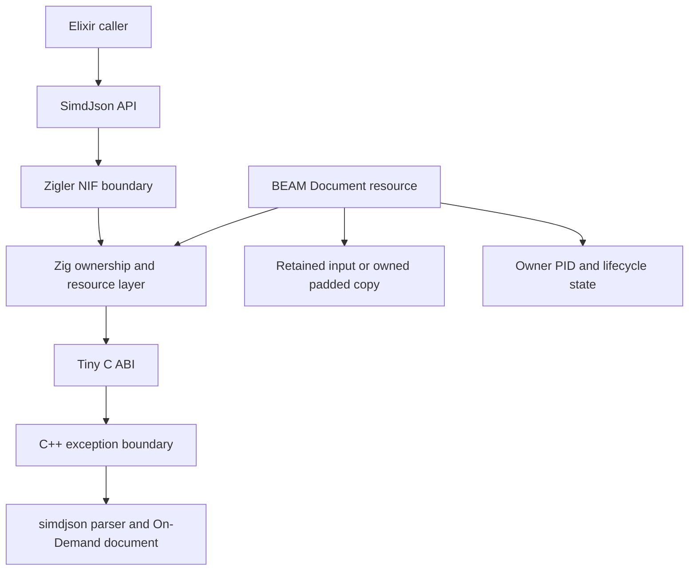

# Milestone 1 — Native Foundation and Opaque Document Resource

[Back to the architecture overview](https://github.com/pcharbon70/simd_json/blob/main/.spec/research/simdjson_beam_nif_architecture.md#proposed-implementation-milestones)

## Outcome

This milestone establishes the smallest safe vertical slice from Elixir to simdjson. At its end, Elixir can open a JSON binary as an opaque `SimdJson.Document`, report parse errors consistently, and release every native allocation safely.

The purpose is architectural confidence, not a broad user-facing API or headline performance. Every later milestone depends on the resource, ownership, build, error, and scheduler boundaries established here.

## Normative decisions and specifications

Milestone 1 is governed by these accepted architecture decisions:

- [Native Stack and C ABI Boundary](https://github.com/pcharbon70/simd_json/blob/main/.spec/decisions/0001-native-stack-and-c-abi.md)
- [Document Resource and Input Buffer Ownership](https://github.com/pcharbon70/simd_json/blob/main/.spec/decisions/0002-document-resource-and-buffer-ownership.md)
- [Off-Scheduler Native Execution](https://github.com/pcharbon70/simd_json/blob/main/.spec/decisions/0003-off-scheduler-native-execution.md)

Its implementation and closure evidence are defined by these active specifications:

- [Native Build and ABI](https://github.com/pcharbon70/simd_json/blob/main/.spec/specs/native_build_and_abi.spec.md)
- [Document Resource](https://github.com/pcharbon70/simd_json/blob/main/.spec/specs/document_resource.spec.md)
- [Native Execution](https://github.com/pcharbon70/simd_json/blob/main/.spec/specs/native_execution.spec.md)
- [Document API and Errors](https://github.com/pcharbon70/simd_json/blob/main/.spec/specs/document_api.spec.md)

Implementation is sequenced by the [Milestone 1 Native Foundation Implementation Plan](https://github.com/pcharbon70/simd_json/blob/main/.spec/planning/milestone_01_native_foundation/README.md).

The four specifications have executable verification and no bootstrap
exceptions. The implementation, operating limits, maintenance workflow, and
qualification commands are collected in the
[Milestone 1 Native Foundation Operations](./01-native-foundation-operations.md)
guide. The immutable qualification identity, supported target, results, and
artifact layout are collected in the
[Milestone 1 Acceptance Record](./01-native-foundation-acceptance.md).

## Status

Milestone 1 is active for the single supported Ubuntu 24.04 x86-64 target. Its
package, ABI, resource, threaded execution, public API, sanitizer, scheduler,
lifecycle, shutdown, scope, and traceability gates are reproducible in CI.
Experimental and unsupported targets do not inherit that claim.

## Scope

This milestone includes:

- a reproducible native build containing the official simdjson C++ library;
- a small, exception-safe C ABI over the required simdjson operations;
- Zig code for resource ownership, BEAM term conversion, and NIF integration;
- a minimal Elixir wrapper around an opaque document resource;
- safe input-buffer ownership and padding behavior;
- structured parse and lifecycle errors;
- deterministic explicit and garbage-collection-driven cleanup;
- scheduler-safety tests for opening large documents.

This milestone does not include projection, array streaming, the final bounded worker pool, telemetry, or full JSON-to-BEAM decoding. Those belong to later milestones.

## Component boundary



Each boundary has one job:

- Elixir validates options and presents idiomatic return values.
- Zigler connects the Elixir module to the native implementation.
- Zig owns BEAM resources, buffers, synchronization, and result marshalling.
- The C ABI prevents C++ templates, exceptions, and object layouts from leaking upward.
- C++ translates the narrow ABI into simdjson calls.

The C ABI must remain small enough that its behavior can be tested independently of the BEAM.

## Milestone 1 Elixir contract

The implemented API is deliberately narrow:

```elixir
{:ok, document} = SimdJson.open(json_binary)
:ok = SimdJson.close(document)
```

The expected types are:

```elixir
@spec open(binary()) :: {:ok, SimdJson.Document.t()} | {:error, SimdJson.Error.t()}
@spec close(SimdJson.Document.t()) :: :ok | {:error, SimdJson.Error.t()}
```

`open/1` accepts a binary in the first implementation. Iodata support can be added in Elixir later, but it must be explicit that converting iodata creates a contiguous binary.

`close/1` provides deterministic release for large documents. Garbage collection remains a safety net, and cleanup must be idempotent so an explicit close followed by resource destruction cannot double-free memory. Any operation after close returns `{:error, %SimdJson.Error{reason: :closed}}`.

`SimdJson.Document` must not expose a native address or cursor state. It can be an Elixir struct containing only the NIF resource reference, with a redacted `Inspect` implementation if necessary.

The only documented runtime modules in this milestone are `SimdJson`,
`SimdJson.Document`, and `SimdJson.Error`; the only root operations are
`open/1` and `close/1`. Native diagnostics, resource helpers, accounting, and
failure injection stay hidden or test-only. Decode, projection, streaming,
cursors, ownership transfer, and raw handles remain absent.

## Native resource model

The document resource owns or retains everything the On-Demand parser can reference.

| Resource field | Responsibility |
| --- | --- |
| Input backing | Retain the BEAM binary or own the padded native copy. |
| Parser handle | Own the simdjson parser for at least as long as the document. |
| Document handle | Own the active On-Demand document state. |
| Owner PID | Prevent accidental concurrent cursor use across processes. |
| Lifecycle state | Distinguish `open`, `closing`, and `closed`. |
| Generation | Detect stale child resources and consumed cursor state later. |
| Synchronization | Protect lifecycle transitions, not promise shared-cursor semantics. |

The required lifetime ordering is:

```text
child cursor, when introduced
        ↓ retains
document resource
        ↓ retains or owns
input memory
```

Destruction occurs in the reverse order. The On-Demand document is destroyed before its parser and input buffer. A future cursor resource must keep its parent document resource alive rather than copying a raw pointer out of it.

## Input-buffer strategy

simdjson may read into padding beyond the logical JSON length. An ordinary BEAM binary does not promise that this padding exists, so zero-copy must never be assumed from pointer availability alone.

The safe baseline is:

1. Allocate an aligned native buffer with the required simdjson padding.
2. Copy the JSON bytes once.
3. Zero the padding or initialize it as required by the pinned simdjson API.
4. Keep the padded buffer in the document resource.
5. Release it only after the parser and document are destroyed.

A zero-copy mode can be added only after the exact simdjson entry point, alignment rules, padding contract, and BEAM binary allocation behavior are verified together. It should be capability-gated and covered by guard-page tests. Correctness is more important than avoiding the initial copy.

## C ABI design

The shim should expose opaque handles and plain C values. A representative shape is:

```c
typedef struct sj_document sj_document;

typedef struct {
  int32_t code;
  size_t byte_offset;
} sj_status;

sj_status sj_document_open(
    const uint8_t *data,
    size_t length,
    sj_document **out_document
);

void sj_document_destroy(sj_document *document);
```

The actual ABI may separate parser and document handles, but it must preserve these rules:

- no C++ type appears in a public header;
- no C++ exception crosses the ABI;
- every successful constructor has one matching destructor;
- error codes are stable and translated in one place;
- pointer and length pairs are validated before use;
- destruction functions accept a null handle safely when practical.

The shim should have native unit tests for valid input, malformed input, empty input, allocation failure paths where injectable, and repeated destruction behavior.

## Scheduler contract

Parsing work must not execute as an ordinary synchronous NIF. Milestone 1 may use the pinned Zigler version's supported threaded execution facility or another verified off-scheduler mechanism. The exact mechanism can evolve in Milestone 4, but the observable rule is fixed now: a large parse cannot monopolize a normal BEAM scheduler.

The Elixir wrapper may wait for an asynchronous native reply while the calling process is suspended in the usual BEAM way. It must correlate replies with a unique request reference and ignore or clean up late replies after timeout or caller termination.

Scheduler responsiveness is part of correctness. A test should run repeated large opens while independent BEAM processes measure wake-up latency.

The threaded mechanism used here qualifies the ownership and scheduler
boundary; it is not the production admission-control design. Milestone 4 adds
the bounded worker pool, backpressure, and production overload behavior.

## Errors

Native failures become data before they cross into Elixir:

```elixir
{:error,
 %SimdJson.Error{
   reason: :invalid_json,
   byte_offset: 128,
   message: "invalid JSON"
 }}
```

The stable initial reasons should cover at least:

- `:invalid_json`;
- `:invalid_utf8`;
- `:unexpected_eof`;
- `:out_of_memory`;
- `:closed`;
- `:not_owner`;
- `:native_failure` for an unmapped internal error.

The numeric simdjson code can be retained for diagnostics, but callers should branch on the stable Elixir reason. Error messages are explanatory and must not be the machine-readable contract.

## Implementation work

1. Pin compatible Elixir, Zigler, Zig, C++, and simdjson versions in the build.
2. Decide whether simdjson is vendored, fetched reproducibly, or supplied by a package artifact.
3. Build the C++ shim with hidden symbols except for the C ABI.
4. Add Zig declarations for the ABI and compile/link them through the native build.
5. Define the document resource type and destructor.
6. Implement padded input ownership first.
7. Implement `SimdJson.open/1` and `close/1` with structured errors.
8. Add owner and lifecycle checks that later operations can reuse.
9. Add debug counters or test hooks for resource creation and destruction.
10. Document supported CPU and operating-system targets and validate simdjson runtime dispatch.

## Verification strategy

The test suite should cover:

- valid objects, arrays, scalars, whitespace-only input, and empty input;
- malformed JSON at the beginning, middle, and end of a buffer;
- UTF-8 failures and embedded null bytes;
- binaries that become otherwise unreachable immediately after `open/1`;
- repeated explicit close and close-after-garbage-collection scenarios;
- operations from a non-owner process;
- concurrent opens of independent documents;
- large inputs while scheduler-latency probes run;
- native sanitizer builds for leaks, use-after-free, overflow, and double-free;
- repeated load/unload in test environments where NIF reload is supported.

Native memory should return to its baseline after documents are closed and garbage collection runs. Tests should not rely only on BEAM heap measurements because the padded buffer and simdjson allocations live outside it.

## Completion criteria

Milestone 1 is complete when:

- a clean checkout can build the native stack reproducibly;
- `open/1` returns an opaque document for valid JSON and a structured error for invalid JSON;
- large parses do not block normal schedulers;
- input memory remains valid for the entire document lifetime;
- explicit close and resource destruction are idempotent and sanitizer-clean;
- C++ exceptions cannot cross the C ABI;
- the resource model is documented well enough for Milestone 2 to add traversal without changing ownership fundamentals.

The completion evidence is produced by the checked-in qualification commands
and summarized by the
[Milestone 1 Acceptance Record](./01-native-foundation-acceptance.md). The
parent-retention and generation helpers are ready for a later cursor, but no
cursor or traversal API is exposed in this milestone.

## Decisions to record

Before closing the milestone, record architecture decisions for:

- native dependency acquisition and version pinning;
- the initial off-scheduler execution mechanism;
- padded-copy versus verified zero-copy support;
- resource ownership and explicit-close semantics;
- supported platforms and CPU dispatch behavior.
