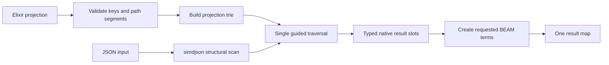

# Milestone 2 — Projection with `SimdJson.select/2`

<!-- covers: simd_json.package.documentation_layout -->

[Back to the architecture overview](https://github.com/pcharbon70/simd_json/blob/main/.spec/research/simdjson_beam_nif_architecture.md#proposed-implementation-milestones)

## Outcome

This milestone delivers the library's primary value proposition: extract a small, caller-defined projection from a JSON document in one native traversal and return only the requested values as BEAM terms.

For a large input, the cost should be proportional to parsing and locating the selected paths, not to allocating an equivalent Elixir map and list tree. `select/2` is therefore more important to the product than eager `decode/1`.

## Normative decisions, specifications, and plan

Milestone 2 is governed by these accepted architecture decisions:

- [Projection API and Validation Contract](https://github.com/pcharbon70/simd_json/blob/main/.spec/decisions/0004-projection-api-and-validation-contract.md)
- [Prefix-Sharing Native Projection Engine](https://github.com/pcharbon70/simd_json/blob/main/.spec/decisions/0005-prefix-sharing-native-projection-engine.md)
- [Projection Admission, Consumption, and Lifetime](https://github.com/pcharbon70/simd_json/blob/main/.spec/decisions/0006-projection-admission-consumption-and-lifetime.md)

Its implementation and closure evidence are defined by these planned
current-truth specifications:

- [Projection API](https://github.com/pcharbon70/simd_json/blob/main/.spec/specs/projection_api.spec.md)
- [Projection Engine](https://github.com/pcharbon70/simd_json/blob/main/.spec/specs/projection_engine.spec.md)
- [Projection Execution and Lifecycle](https://github.com/pcharbon70/simd_json/blob/main/.spec/specs/projection_execution.spec.md)

Implementation is sequenced by the
[Milestone 2 Projection API Implementation Plan](https://github.com/pcharbon70/simd_json/blob/main/.spec/planning/milestone_02_projection_api/README.md).

The Milestone 1 native stack, document ownership, and off-scheduler execution
decisions remain binding prerequisites throughout this work.

## Status

Phases 1 through 5 are implemented. `SimdJson.select/2`, its exact projection
grammar, prefix-sharing traversal, threaded one-shot lifecycle, stable errors,
and public documentation are available. The three specifications remain
planned under explicit bootstrap exceptions until Phase 6 records the full
supported-target sanitizer, scheduler, lifecycle, package, and end-to-end Jason
benchmark evidence and activates them together.

The current Zigler-threaded execution layer remains a pre-production
qualification runtime. The bounded worker pool, admission backpressure, and
public telemetry are deferred to Milestone 4.

## Prerequisites

Milestone 1 must already provide:

- a safe opaque `SimdJson.Document` resource;
- stable input-buffer and parser lifetimes;
- off-scheduler native execution;
- structured errors;
- owner and closed-resource checks.

Projection should reuse those contracts rather than introduce a second parsing or ownership model.

## Public API

The baseline API accepts either a binary or an open document:

```elixir
projection = [
  id: ["customer", "id"],
  name: ["customer", "name"],
  first_sku: ["orders", 0, "sku"],
  total: ["order", "total"]
]

{:ok, result} = SimdJson.select(json, projection)
```

with a result such as:

```elixir
%{
  id: 1234,
  name: "Acme",
  first_sku: "ABC-123",
  total: 987.42
}
```

The binary form creates a temporary document, evaluates the projection, and
releases every temporary native allocation before returning. The document form
consumes one fresh caller-owned document exactly once:

```elixir
SimdJson.select(document, projection)
```

Once native cursor access begins, the document becomes consumed whether
projection succeeds or fails. A later attempt returns `:cursor_consumed`
instead of rewinding or silently reparsing. Projection validation and a proven
pre-worker submission rejection do not consume the document.

## Projection specification

A projection is a non-empty proper list of output-key and path pairs.

- Output keys are atoms or binaries supplied by trusted caller code.
- Object path segments are UTF-8 binaries.
- Array path segments are integers from zero through `UINT64_MAX`.
- Empty paths are rejected initially because selecting the entire root undermines the milestone's bounded-output goal.
- Duplicate output keys are rejected before native execution.
- Duplicate paths under different output keys are allowed and share one native terminal value.
- Map-shaped projections and improper lists are rejected because they cannot preserve complete duplicate-key validation and deterministic structure.
- Invalid path segment types return `:invalid_projection`.

JSON keys must never be converted to atoms. An atom output key is safe only because it already exists in the caller's projection.

The first version guarantees scalar leaves: strings, integers, floats, booleans,
and `nil`. Selecting an object or array as a leaf returns `:incorrect_type`; it
never materializes a subtree merely because a path stopped early.

## Compile once, traverse once

Performing one independent lookup for every requested path would repeatedly move through the On-Demand cursor and create order-dependent behavior. Instead, the projection should be normalized into a native selection tree before traversal.



For the paths:

```text
customer.id
customer.name
order.total
```

the internal representation shares the `customer` prefix:

```text
root
├── customer
│   ├── id   → result slot 0
│   └── name → result slot 1
└── order
    └── total → result slot 2
```

The traversal follows document order and matches requested fields as they are encountered. It does not repeatedly rewind the cursor to honor projection declaration order. Result slots restore the caller's output keys after traversal.

The traversal also structurally consumes the complete logical JSON value,
including unselected branches and content after the last requested value.
Skipping avoids materialization; it does not allow malformed JSON to pass.
When a requested object key is repeated, its first occurrence in document order
supplies the result and later occurrences are consumed only for validation.

This design also gives a natural foundation for a later public compile-once API,
where the validated projection tree can be reused across many documents.

No compiled projection is public in Milestone 2. Another projection requires a
new document or another binary `select/2` call; the library does not rewind,
silently reparse, or cache a reusable plan.

## Result conversion

Only selected values cross into the BEAM.

| JSON value | Elixir value | Notes |
| --- | --- | --- |
| string | binary | Copy into a fresh small binary by default. |
| signed integer | integer | Preserve exact value within the supported native range. |
| unsigned integer | integer | Validate conversion and range explicitly. |
| floating point | float | Define non-finite handling even though JSON forbids such literals. |
| `true` / `false` | boolean | Use existing atoms only. |
| `null` | `nil` | Use the existing atom. |

Selected strings are copied into independent result binaries. Returning a
sub-binary backed by a multi-gigabyte source would retain that source long after
the document would otherwise be collectible.

BEAM terms should be created after the native traversal has identified and validated all result values, or in bounded steps with a clear cleanup path. A partially built result must never escape after a later field fails.

## Missing fields and type errors

The baseline should be deterministic and fail fast:

```elixir
{:error,
 %SimdJson.Error{
   reason: :no_such_field,
   path: ["customer", "name"]
 }}
```

The initial behavior is:

- a missing object field returns `:no_such_field`;
- an array index beyond the end returns `:index_out_of_bounds`;
- applying a field segment to a non-object returns `:incorrect_type`;
- applying an index segment to a non-array returns `:incorrect_type`;
- malformed JSON returns the parse error with a byte offset when available;
- a previously consumed document returns `:cursor_consumed`;
- cancellation returns `:cancelled`.
- a requested object or array terminal returns `:incorrect_type`.

Options such as defaults, optional fields, per-field errors, and null substitution can be designed later. Adding them prematurely complicates both the native result layout and the meaning of a successful projection.

## One boundary crossing

The performance contract is not merely that simdjson performs the parse. The entire projection must be submitted in one call and returned as one result:

```text
BEAM → validate and enqueue projection → native traversal → build result → BEAM
```

An implementation where each path segment or each selected field invokes another NIF does not satisfy this milestone. Crossing overhead, repeated ownership checks, and forward-only cursor behavior would erase the architectural advantage.

## Document-state behavior

Projection operates under the document's owner and lifecycle rules:

- only the owner process can consume a stateful document;
- one projection runs against a document at a time;
- owner close cancels active projection at a safe boundary, waits for terminal
  reservation release, and then performs exactly-once cleanup;
- every operation checks the resource generation before dereferencing native state;
- a failed projection leaves the document in an explicitly defined state.

A projection that reaches native cursor access consumes the On-Demand document
whether it succeeds or fails. Invalid preflight and proven pre-worker submission
rejection leave it fresh. Reuse can be added only through a superseding decision
that proves explicit reset or reparse semantics without surprise.

## Implementation work

1. Define and document the accepted projection term grammar.
2. Validate the complete projection in Elixir or bounded native code before parsing.
3. Compile paths into a prefix-sharing native representation.
4. Traverse objects and arrays once without cursor rewinds.
5. Store located values in typed result slots.
6. Copy strings into fresh BEAM binaries during result conversion.
7. Return one result map with the caller-provided keys.
8. Map path, type, parse, lifecycle, and cancellation errors consistently.
9. Add internal timing for projection compilation, traversal, and term construction so later telemetry can expose it.
10. Document document-consumption semantics and enforce them in tests.

## Verification strategy

Functional tests should cover:

- shared path prefixes and paths in different object branches;
- projection order different from JSON field order;
- nested objects and array indices;
- empty strings, Unicode keys, escaped keys, and escaped string values;
- every scalar JSON type;
- missing fields, wrong container types, and out-of-range indices;
- duplicate output keys and malformed projection terms;
- duplicate keys in the input JSON under the first-occurrence policy;
- invalid JSON before, inside, and after a selected branch;
- very large unselected subtrees;
- process ownership, close races, and consumed documents.

Performance tests should compare:

```text
SimdJson.select/2

against

full decode + get_in/2
```

for small, medium, and very large documents. Measure end-to-end latency, throughput, BEAM allocations, native allocations, retained binary memory, garbage-collection time, and scheduler latency. A projection benchmark must include the cost of parsing and result construction rather than timing only an already-positioned cursor.

## Completion criteria

Milestone 2 is complete when:

- one `select/2` call can extract multiple scalar paths from a binary;
- common path prefixes are traversed once;
- only selected values become BEAM terms;
- declaration order does not depend on JSON object order;
- missing and incorrectly typed paths produce structured errors;
- selected strings do not retain the source binary by default;
- document consumption and ownership behavior are deterministic;
- benchmarks demonstrate the expected allocation advantage over full materialization;
- large projections preserve the scheduler-safety guarantee from Milestone 1.

## Deferred work

The following are intentionally outside this milestone unless needed to complete the baseline:

- a public compiled-projection resource;
- JSONPath syntax;
- wildcard or recursive descent paths;
- filters and predicates;
- optional/default field policies;
- selecting and materializing arbitrary container subtrees;
- batch streaming across repeated array elements.
