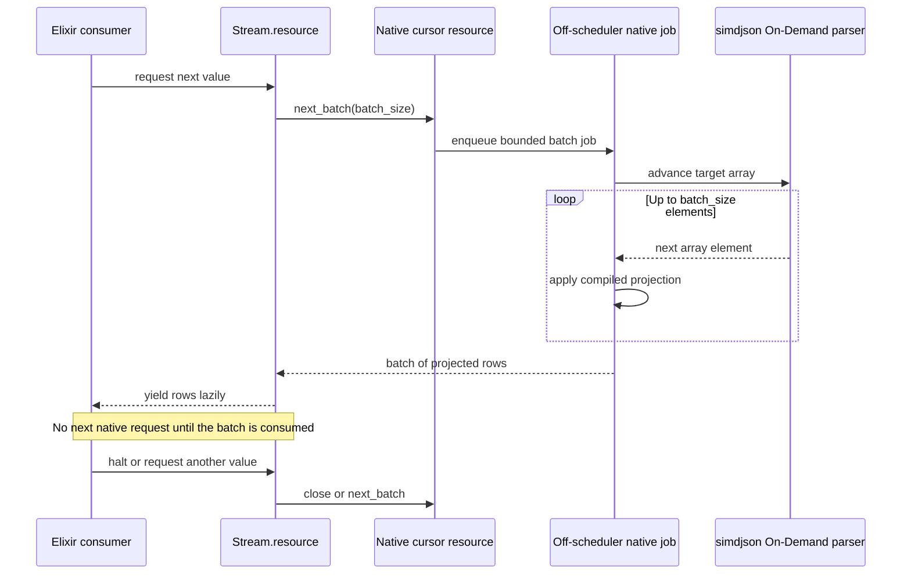

# Milestone 3 — Batched Array Streaming

[Back to the architecture overview](../../.spec/research/simdjson_beam_nif_architecture.md#proposed-implementation-milestones)

## Outcome

This milestone makes very large JSON arrays consumable as a lazy Elixir `Enumerable` without materializing the entire array or making one NIF call per field. Native code advances the simdjson On-Demand cursor, projects a bounded number of rows, and returns those rows as one batch.

The result is an ETL-oriented API that combines native parsing throughput with BEAM backpressure and bounded allocation.

## Normative decisions, specifications, and plan

Milestone 3 is governed by these accepted architecture decisions:

- [Lazy Stream API and Bounded Options](https://github.com/pcharbon70/simd_json/blob/main/.spec/decisions/0007-lazy-stream-api-and-bounded-options.md)
- [Forward-Only Batched Array Cursor](https://github.com/pcharbon70/simd_json/blob/main/.spec/decisions/0008-forward-only-batched-array-cursor.md)
- [Stream Ownership, Backpressure, and Lifetime](https://github.com/pcharbon70/simd_json/blob/main/.spec/decisions/0009-stream-ownership-backpressure-and-lifetime.md)

Its implementation and closure evidence are defined by these planned
current-truth specifications:

- [Streaming API](https://github.com/pcharbon70/simd_json/blob/main/.spec/specs/streaming_api.spec.md)
- [Stream Cursor and Batch Engine](https://github.com/pcharbon70/simd_json/blob/main/.spec/specs/stream_cursor.spec.md)
- [Stream Execution and Lifecycle](https://github.com/pcharbon70/simd_json/blob/main/.spec/specs/stream_execution.spec.md)

Implementation is sequenced by the
[Milestone 3 Batched Array Streaming Implementation Plan](https://github.com/pcharbon70/simd_json/blob/main/.spec/planning/milestone_03_batched_array_streaming/README.md).

All Milestone 1 and 2 ABI, input ownership, document lifecycle, projection,
atom-safety, error, off-scheduler, and qualification decisions remain binding.

## Status

Milestone 3 is planned. Its three specifications retain complete bootstrap
exceptions until public Enumerable, native safety, demand, scheduler,
lifecycle, bounded-memory, and end-to-end ETL evidence is executed.

## Prerequisites

Milestones 1 and 2 must already provide:

- safe document and input-buffer ownership;
- structured parse, path, type, and lifecycle errors;
- an internal projection representation;
- one-pass extraction of multiple fields;
- copied output strings that do not retain the source document;
- an off-scheduler execution mechanism.

Streaming reuses the projection engine once per array element. It must not implement a separate field-extraction path.

## Public API contract

The primary API is lazy:

```elixir
stream =
  SimdJson.stream(json,
    path: ["customers"],
    fields: [
      id: ["id"],
      email: ["contact", "email"]
    ],
    batch_size: 1_000,
    max_batch_bytes: 8_388_608
  )

stream
|> Stream.filter(&active_customer?/1)
|> Enum.reduce(0, &accumulate/2)
```

The source is either a JSON binary or a genuine `SimdJson.Document`. No native
parse, reservation, target lookup, plan construction, or cursor creation begins
merely because `stream/2` returned. Work starts when the owner reduces the
Enumerable.

The baseline options are:

| Option | Meaning |
| --- | --- |
| `:path` | Path from the document root to the target array. |
| `:fields` | Projection applied relative to each array element. |
| `:batch_size` | Maximum projected rows per native request; defaults to `1_000` and is limited to `10_000`. |
| `:max_batch_bytes` | Maximum ABI-defined encoded result bytes per native batch; defaults to `8_388_608` and is limited to `67_108_864`. |

The target path reuses Milestone 2's UTF-8 object-segment and unsigned-index
grammar but permits `[]` to select a top-level array. Fields use the complete
non-empty Milestone 2 projection grammar. Options form a closed proper keyword
list: missing required keys, duplicates, unknown keys, malformed paths or
fields, and out-of-range limits raise `ArgumentError` synchronously.

Milestone 3 exposes no `stream_batches/2` or raw cursor API. `stream/2` flattens
private native batches into row maps without causing row-by-row NIF calls.

## Execution model



Only one batch is in flight for a stream. This is the basic backpressure mechanism: the consumer's demand controls when native parsing advances.

## Stream resource ownership

A stream needs its own native cursor resource. It retains the parent document, which retains the input buffer:

```text
stream cursor
    ↓ retains
document
    ↓ retains or owns
input memory
```

The cursor stores:

- the current array iterator position;
- the compiled per-row projection;
- the owning PID;
- the cursor generation;
- current state: `ready`, `running`, `done`, `cancelled`, or `closed`;
- cancellation and close flags;
- the configured row and encoded-byte limits.

The stream is single-owner. Passing the enumerable term to another process does not transfer the native cursor automatically. A future explicit ownership-transfer API can be considered, but silent shared consumption is invalid.

## Lazy lifecycle

The Elixir implementation uses a lifecycle equivalent to `Stream.resource/3`:

1. `stream/2` validates source shape and all options without native work.
2. The reduction start function verifies ownership, opens or reserves the document, locates the array, compiles one projection, and creates the cursor.
3. The next function requests one native batch.
4. Rows are emitted from the in-memory batch before another native request is made.
5. End-of-array returns terminal metadata with the final useful batch.
6. The after function cancels in-flight work if needed and closes the cursor.

Early termination must be normal:

```elixir
SimdJson.stream(json, options)
|> Enum.take(10)
```

This must release the cursor and document without scanning the remainder of the array. Resource destructors remain a fallback for abandoned enumerables, but normal enumeration should clean up deterministically.

## Batch construction

For each batch, native code should:

1. Confirm owner, generation, and open state.
2. Reserve bounded result-slot storage for at most `batch_size` rows.
3. Advance one array element at a time.
4. Apply the compiled field projection to the element.
5. Copy selected strings into result-owned or BEAM-owned storage.
6. Stop at the batch limit, end of array, cancellation, or error.
7. Marshal the completed batch into BEAM terms once.

`max_batch_bytes` bounds row descriptors, typed slots, copied selected strings,
and other variable batch-result storage defined by private ABI v3. A later row
that does not fit begins the next batch. A single row that cannot fit an empty
batch raises `SimdJson.Error` with reason `:batch_too_large` and its source
array index; the implementation never exceeds the bound merely to progress.

The batch container can be a list initially. Alternative representations should be justified by measured conversion and consumption costs, not by native convenience.

## Backpressure and bounded memory

The stream should maintain at most:

- one active native batch job;
- one returned batch being consumed;
- the native parser, document, cursor, and projection state;
- the retained input buffer.

It should not prefetch multiple batches in Milestone 3. Prefetch can improve throughput but weakens cancellation, increases memory, and complicates ordering. It can be added later as an opt-in feature with a strict bound.

Batch-size tuning represents a tradeoff:

| Smaller batches | Larger batches |
| --- | --- |
| Faster cancellation | Fewer native crossings |
| Lower peak memory | Better amortization |
| Fairer interleaving | Higher throughput potential |
| More message overhead | Larger latency spikes |

Defaults should be selected using end-to-end ETL benchmarks rather than parser throughput alone.

## Error behavior

Errors can occur before enumeration, between batches, or while projecting a row. A lazy enumerable cannot always return a top-level `{:error, reason}` after it has yielded earlier rows.

The contract is:

- option-validation errors are raised immediately as `ArgumentError` because they are caller mistakes;
- JSON, path, type, cancellation, and native failures during enumeration raise `SimdJson.Error`;
- the exception includes the source array index and projection path when known;
- cursor cleanup runs before the exception reaches the consumer;
- no row from the failing in-flight batch is yielded;
- rows from previously completed batches remain already observed and are not rolled back.

If a tagged, non-raising streaming API is desired, expose it separately so every yielded item has an unambiguous type. Do not sometimes yield maps and sometimes an error tuple from the same API without documenting that contract.

## Cancellation and early halt

Milestone 3 must provide a cancellation flag and safe checks even before Milestone 4 adds full process monitoring and queue management.

Cancellation checks should occur:

- before starting a batch;
- between array elements;
- before expensive result conversion;
- while converting unusually large values where practical;
- before sending the completed batch.

Early halt sets the flag, waits for or safely detaches any in-flight job according to the resource protocol, and closes the cursor. No thread may continue dereferencing a resource after its destructor has run.

## Implementation work

1. Define and validate `stream/2` options.
2. Add a cursor resource that retains its parent document.
3. Locate and validate the target array once.
4. Reuse the Milestone 2 projection representation for each element.
5. Implement `next_batch` with row and byte bounds.
6. Wrap the cursor in an Elixir enumerable with deterministic cleanup.
7. Handle end-of-array without an extra parse or rewind.
8. Add cancellation checks and early-halt behavior.
9. Include array index and projection path in runtime errors.
10. Measure and document recommended batch sizes for representative workloads.

## Verification strategy

Functional tests should cover:

- empty arrays and arrays smaller than, equal to, and larger than one batch;
- exact batch-boundary end-of-array behavior;
- nested array paths;
- arrays containing objects with every scalar value type;
- an invalid element after several successful batches;
- missing or incorrectly typed projected fields;
- invalid JSON near the end of a large array;
- `Enum.take/2`, `Enum.find/2`, consumer exceptions, and explicit process exit;
- attempts to enumerate from a non-owner process;
- concurrent streams backed by independent documents;
- garbage collection of a stream that was created but never enumerated.

Stress and performance tests should measure:

- rows and input bytes per second;
- time to first row and time to first batch;
- peak BEAM heap, binary memory, and native memory;
- memory behavior across thousands of batches;
- scheduler latency under concurrent consumers;
- early-halt latency;
- native calls and messages per batch;
- throughput across a batch-size matrix.

The test suite should include a slow consumer to prove that the parser does not run arbitrarily far ahead.

## Completion criteria

Milestone 3 is complete when:

- a target array can be consumed lazily through an Elixir `Enumerable`;
- each native call produces a bounded batch, not one field or one row;
- only one batch is in flight per stream;
- the stream does not materialize the full array;
- early halt releases resources without parsing the remaining input;
- cursor ownership and parent-document lifetimes are enforced;
- mid-stream failures report the array index and clean up safely;
- memory remains bounded across inputs containing millions of records;
- scheduler responsiveness remains acceptable under concurrent streaming workloads.

## Deferred work

The following can wait for later milestones or measured need:

- multi-batch prefetch;
- parallel parsing of one array;
- cursor transfer between processes;
- checkpointing and resumable streams;
- filters, transforms, or arbitrary Elixir callbacks inside native traversal;
- distributed stream coordination.
