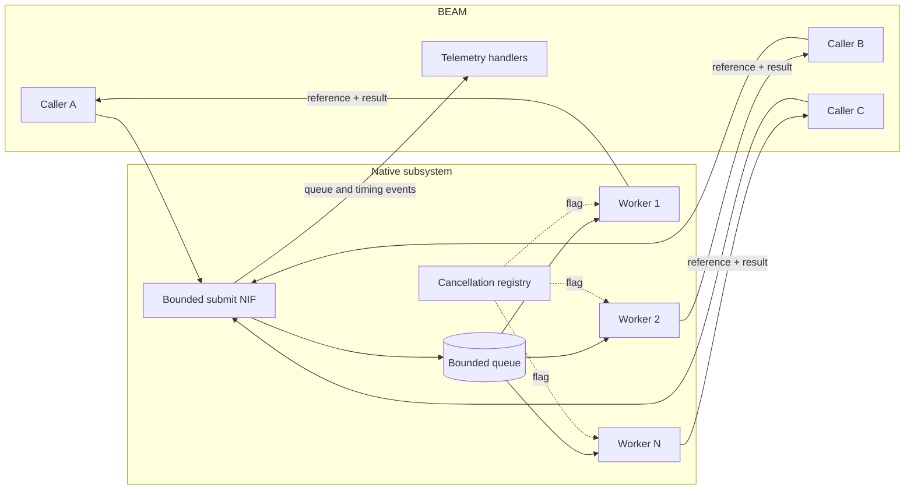
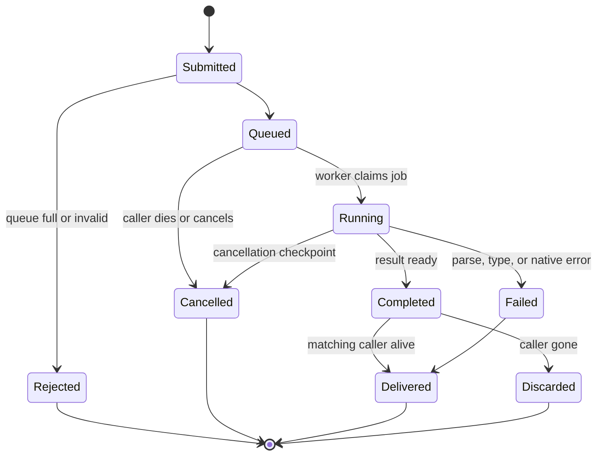

# Milestone 4 — Worker Pool, Cancellation, Backpressure, and Telemetry

[Back to the architecture overview](../research/simdjson_beam_nif_architecture.md#proposed-implementation-milestones)

## Outcome

This milestone turns native execution into an operationally predictable subsystem. Long-running parse, projection, and streaming work moves through a fixed native worker pool with a bounded queue, explicit cancellation, measurable backpressure, and telemetry suitable for production capacity planning.

Earlier milestones must already avoid normal scheduler blocking. Milestone 4 replaces any provisional execution mechanism with a library-owned concurrency model whose capacity and failure behavior are explicit.

## Prerequisites

Milestones 1 through 3 must provide stable:

- document and cursor resource lifetimes;
- native operation boundaries;
- structured error translation;
- projection jobs;
- batch jobs and cancellation checkpoints;
- deterministic close behavior.

The pool should schedule those existing jobs rather than duplicate parsing logic.

## Architecture



Normal scheduler work is limited to validating small terms, enqueueing a bounded job descriptor, and receiving a result message. Parsing and traversal occur only on native workers.

## Pool sizing

The worker count is fixed after startup or after an explicitly supported reconfiguration boundary. A reasonable initial default is based on online schedulers but should be conservative because simdjson is CPU- and memory-bandwidth-intensive.

```elixir
config :simd_json,
  native_workers: max(2, div(System.schedulers_online(), 2)),
  native_queue_size: 256
```

The exact configuration surface is a design decision, not a promise of these names. Requirements are:

- a finite worker count;
- a finite queue length;
- validated minimums and maximums;
- observable effective configuration;
- no implicit OS thread per request;
- no use of the dirty CPU scheduler queue as the library's unbounded work queue.

Worker sizing benchmarks should consider physical cores, simultaneous multithreading, memory bandwidth, input size, and other native workloads in the VM. `System.schedulers_online/0` is an upper-bound signal, not proof of the optimal pool size.

## Job model

Every submitted operation becomes a job descriptor containing at least:

| Field | Purpose |
| --- | --- |
| Request reference | Correlates exactly one reply with one Elixir call. |
| Caller identity | Supports monitoring, cancellation, and ownership checks. |
| Operation kind | Open, select, next batch, decode, or close-related work. |
| Resource references | Keep documents and cursors alive while queued or running. |
| Native arguments | Validated, owned data needed by the worker. |
| Cancellation flag | Allows lock-free or low-contention cooperative cancellation. |
| Enqueue timestamp | Measures queue delay. |
| Deadline, if supported | Prevents stale work from starting after caller timeout. |

Job arguments must not contain borrowed pointers into temporary NIF call environments. Terms needed after the submit NIF returns must be copied into owned native memory or retained through documented resource APIs.

Each worker owns any reusable parser scratch state that is safe to reuse. Stateful document or cursor handles remain owned by their resources and are accessed under the resource protocol. Parser reuse must never cause one document's state or errors to leak into another job.

## Request lifecycle



State transitions must be atomic enough that exactly one component owns cleanup. Cancellation and completion racing with one another may select either valid terminal state, but they may not double-send, double-free, or leave a resource permanently busy.

## Queue backpressure

Submitting a job must not block a normal scheduler waiting for queue capacity. When the bounded queue is full, the submit operation should return immediately:

```elixir
{:error, %SimdJson.Error{reason: :busy}}
```

The Elixir layer can optionally provide a retry or admission-timeout policy, but it must use BEAM timers and process suspension rather than spin or block in native code.

Queue behavior should be first-in, first-out initially. Fairness controls may later prevent one process from occupying the entire queue, but any more complex policy must remain bounded and measurable.

Separate queue limits by operation class should be considered only after evidence shows that long decode jobs starve latency-sensitive projection batches. A single transparent queue is easier to reason about for the first production version.

## Result delivery

Workers send results with a unique request reference:

```elixir
{SimdJson.Native, request_ref, {:ok, value}}
```

The exact message is internal. The Elixir wrapper waits only for its reference and converts timeout or caller cancellation into the appropriate native cancellation request.

Native workers must use an environment allocated for cross-thread message construction and release it after `enif_send` succeeds or fails. A failed send because the process no longer exists is a normal cleanup path, not a native crash.

Late replies must not be mistaken for a later request. Unique references, per-job terminal state, and wrapper mailbox cleanup are all required.

## Cancellation

Cancellation is cooperative because simdjson operations cannot be safely interrupted at an arbitrary instruction.

Cancellation is requested when:

- the caller process terminates;
- an Elixir-side timeout expires;
- a stream halts early;
- a document or cursor is explicitly closed;
- the application or NIF begins shutdown.

Workers check the atomic flag at safe boundaries:

- before beginning queued work;
- between projection branches when practical;
- between streamed array elements;
- between output-conversion chunks;
- before allocating or sending a large reply.

If one simdjson call can run for an unacceptably long interval without a checkpoint, the operation must be decomposed or its maximum uninterruptible time documented and measured.

Monitoring the caller should be tied to a job or resource whose down callback can set the cancellation flag without allocating complex state. Removing a monitor after normal completion must race safely with process termination.

## Resource serialization

The pool permits many independent documents to execute concurrently, but stateful operations on one document or cursor remain serialized.

Recommended behavior:

- independent binary inputs may run on any workers;
- one document accepts at most one state-advancing job at a time;
- a cursor cannot have two `next_batch` jobs queued simultaneously;
- close marks the resource closing and prevents new submissions;
- destruction waits for or is owned by the last job reference without blocking a BEAM scheduler.

A mutex can protect short metadata transitions. It must not be held across result marshalling, message send, or long simdjson traversal unless the entire resource protocol requires it and contention has been analyzed.

## Telemetry

Telemetry should expose operational behavior without logging JSON data, paths containing sensitive field names, or selected values.

Recommended events include:

```text
[:simd_json, :job, :start]
[:simd_json, :job, :stop]
[:simd_json, :job, :exception]
[:simd_json, :queue, :rejected]
[:simd_json, :job, :cancelled]
```

Useful measurements and metadata are:

| Data | Examples |
| --- | --- |
| Durations | Queue time, native execution time, result-conversion time. |
| Sizes | Input bytes, selected value bytes, row count, batch size. |
| Capacity | Configured workers, queue length at submission. |
| Outcome | Success, error category, cancellation, queue rejection. |
| Operation | `open`, `select`, `next_batch`, or `decode`. |

High-cardinality request references, PIDs, arbitrary paths, and error messages should not be telemetry metadata by default. Counters that originate natively can be included in the result envelope and emitted from Elixir to keep telemetry handlers out of native worker threads.

## Startup, shutdown, and upgrade behavior

The worker subsystem must have an explicit VM lifecycle:

1. NIF load allocates shared state, queue primitives, and workers.
2. Load fails cleanly if only part of the pool can be created.
3. Shutdown stops accepting jobs and marks queued jobs cancelled.
4. Workers finish or cancel running jobs at safe checkpoints.
5. Threads join before shared code or state is unloaded.
6. Remaining resources receive deterministic failure replies or safe destructor cleanup.

Hot code loading and NIF upgrades require special care because native threads must not continue executing unloaded code. If safe in-place upgrade cannot be guaranteed, the library should document a restart requirement instead of pretending upgrades are transparent.

## Implementation work

1. Define pool and queue configuration with conservative bounds.
2. Implement shared native pool state and fixed worker startup.
3. Define an owned job descriptor and terminal-state protocol.
4. Implement non-blocking bounded submission.
5. Retain resource references for queued and running jobs.
6. Add request references and safe cross-thread result delivery.
7. Monitor callers and connect down events to cancellation flags.
8. Add cancellation checkpoints to open, select, and batch operations.
9. Serialize stateful operations per document and cursor.
10. Emit telemetry from bounded metadata returned to Elixir.
11. Implement drain, cancellation, join, and unload behavior.
12. Add fault-injection hooks for allocation, queue, send, and shutdown failures.

## Verification strategy

Concurrency tests should include:

- more simultaneous callers than workers and queue slots;
- queue-full rejection without scheduler blocking;
- callers dying while queued, running, and immediately before delivery;
- timeout racing with successful completion;
- close racing with select or next-batch work;
- two operations submitted against one cursor;
- independent documents saturating all workers;
- application shutdown with queued and running work;
- repeated native load/unload where supported.

Operational benchmarks should measure:

- throughput and latency across worker-count and queue-size matrices;
- queue wait and execution duration distributions;
- p50, p95, and p99 caller latency;
- p99 normal scheduler wake-up latency;
- dirty scheduler utilization to confirm it is not the hidden pool;
- cancellation latency for queued and running jobs;
- memory retained by queued job descriptors;
- fairness between small projections and large stream batches.

Sanitizer and race-detector runs should target queue shutdown, cancellation/completion races, resource close races, and result delivery to dead processes.

## Completion criteria

Milestone 4 is complete when:

- the number of native workers and queued jobs is always bounded;
- queue saturation returns a structured error without blocking normal schedulers;
- caller death and early stream halt cancel unnecessary work;
- each request produces at most one terminal result and one cleanup path;
- stateful resources cannot execute conflicting jobs concurrently;
- telemetry reports queue, execution, size, outcome, and cancellation data without user content;
- the pool starts and shuts down without leaked threads or resources;
- stress tests preserve acceptable scheduler latency under saturation;
- pool sizing and operational limits are documented for library users.

## Deferred work

Potential later improvements include:

- workload-specific queues or priorities;
- adaptive worker sizing;
- controlled batch prefetch;
- per-caller admission quotas;
- externally pluggable scheduling;
- distributed capacity coordination.

None of these should weaken the fixed-capacity and non-blocking submission guarantees.
