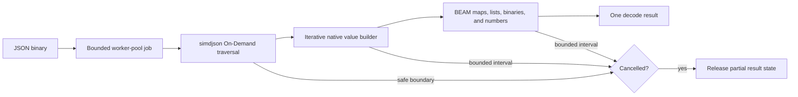

# Milestone 5 — Jason-Compatible Decode API

[Back to the architecture overview](../../.spec/research/simdjson_beam_nif_architecture.md#proposed-implementation-milestones)

## Outcome

This milestone adds familiar eager decoding for applications that need a complete Elixir representation of a JSON value:

```elixir
{:ok, value} = SimdJson.decode(json)
value = SimdJson.decode!(json)
```

The API should be compatible with the commonly expected Jason decoding contract where that contract is safe and practical. Compatibility must be defined by an explicit test matrix against a pinned Jason version, not by a vague claim that every option and edge case behaves identically.

This milestone is intentionally last. Eager decoding necessarily allocates every object, array, key, and scalar as a BEAM term, so it cannot preserve the main allocation advantage of projection and streaming.

## Prerequisites

Milestones 1 through 4 must already provide:

- a safe native build and C ABI;
- input-buffer and parser ownership;
- structured parse errors;
- result conversion for scalar values;
- off-scheduler execution through a bounded worker pool;
- cancellation, queue backpressure, and telemetry;
- memory and scheduler benchmarks.

Decode should reuse these capabilities. It must not add a second native execution path that bypasses queue limits or cancellation.

## API contract

The baseline functions are:

```elixir
@spec decode(binary(), keyword()) ::
        {:ok, term()} | {:error, SimdJson.Error.t()}

@spec decode!(binary(), keyword()) :: term()
```

with empty options by default:

```elixir
SimdJson.decode(json, [])
SimdJson.decode!(json, [])
```

`decode/2` returns a tagged result. `decode!/2` returns the value or raises the same structured error as an exception. Both functions use the same native implementation and differ only in the Elixir wrapper.

The first release should accept binaries. If iodata support is added, its flattening and copy cost must be documented.

Top-level objects, arrays, strings, numbers, booleans, and null are all valid JSON values and should be accepted unless the pinned compatibility target explicitly differs.

## Data mapping

| JSON | Elixir | Required behavior |
| --- | --- | --- |
| object | map | Keys are binaries by default. |
| array | list | Preserve source order. |
| string | binary | Validate escapes and UTF-8; return independent binaries. |
| integer | integer | Preserve exact value under the documented number policy. |
| number with fraction or exponent | float | Reject overflow or invalid forms consistently. |
| `true` | `true` | Existing atom only. |
| `false` | `false` | Existing atom only. |
| `null` | `nil` | Existing atom only. |

JSON input must never create new atoms. A compatibility option that atomizes arbitrary keys is outside the safe default and should not be implemented merely to match another library's optional behavior. If existing-atom conversion is ever offered, it belongs behind an explicit option with tests proving that unknown keys cannot allocate atoms.

## Materialization pipeline



The materializer walks the input once and creates a corresponding BEAM value for every JSON value. It should use an explicit stack rather than unbounded native recursion, because deeply nested untrusted input must not overflow the C++, Zig, or worker thread stack.

One approach is to keep stack frames describing the current container:

```text
object frame: pending key, accumulated entries, depth
array frame: accumulated elements, depth
```

When a scalar is completed, it is attached to the top frame. When a container closes, the frame becomes a BEAM map or list and is attached to its parent. The exact construction order should minimize list reversal and temporary allocation while remaining easy to clean up after failure.

## BEAM term construction

The worker must use an `ErlNifEnv` suitable for cross-thread term construction. Terms built in that environment remain private until the completed result is sent back to the waiting process.

Important constraints are:

- never retain pointers into temporary BEAM terms after their environment is cleared;
- release the environment on success, error, cancellation, and failed send;
- do not send a partially constructed tree;
- copy decoded strings and keys so they do not retain the complete source binary;
- account for both native intermediate memory and the eventual BEAM term size;
- check cancellation while constructing unusually large arrays or objects.

Building the full result in a worker protects normal schedulers from native traversal, but receiving a very large term still creates mailbox, heap, and garbage-collection pressure. Documentation must make clear that eager decode is not the recommended interface for multi-gigabyte payloads.

## Number semantics

Number compatibility requires an explicit policy because simdjson's convenient numeric accessors and Elixir's arbitrary-precision integers do not have identical ranges.

The implementation must distinguish:

- signed 64-bit integers;
- unsigned 64-bit integers;
- integers outside both 64-bit ranges;
- fractional or exponent forms;
- values that overflow finite IEEE-754 doubles;
- syntactically invalid leading zeros, signs, decimal points, or exponents.

For integers beyond native 64-bit accessors, the preferred compatibility path is to obtain the validated numeric token and convert it to an Elixir arbitrary-precision integer without routing through a float. If the pinned simdjson interface cannot expose the token safely, the limitation must produce a documented `:number_out_of_range` error rather than silent rounding.

Floating-point behavior should be compared against the pinned Jason reference. JSON does not permit NaN or infinities, and overflow must not introduce them as successful decoded values unless compatibility tests intentionally establish that behavior.

## Strings and object keys

String handling must cover:

- all JSON escapes;
- Unicode escape sequences and valid surrogate pairs;
- rejection of lone or malformed surrogates under the selected compatibility policy;
- embedded null bytes after decoding;
- invalid raw UTF-8;
- empty strings and empty keys;
- very large individual strings;
- repeated keys and values.

Decoded binaries should have exactly the logical byte length of the decoded string. They should not expose simdjson padding or retain the source buffer.

Object keys are binary terms. Duplicate-key behavior must be measured against the pinned Jason version and then documented, including which value wins and whether an error option exists. The native builder cannot rely accidentally on whatever insertion behavior its temporary map representation happens to have.

## Compatibility matrix

The baseline compatibility target is Jason 1.4.5 with binary input and an
empty option list. Arrays preserve order, object keys remain binaries, the last
duplicate key wins, and all top-level JSON value types are accepted. Iodata,
key atomization, structs, custom decoders, decimal modes, and other non-empty
options are intentionally unsupported in the first release. A byte-order mark,
trailing non-whitespace data, malformed UTF-8 or surrogate pairs, and
non-finite floating results are rejected. Integers must remain exact or return
`:number_out_of_range` without silent float conversion.

Before claiming compatibility, record expected behavior for:

| Area | Questions to settle |
| --- | --- |
| Input types | Binary only or iodata as well? |
| Top-level values | Are all JSON value types accepted? |
| Trailing data | Is non-whitespace after one value rejected? |
| Byte-order mark | Accepted or rejected? |
| Duplicate keys | First wins, last wins, or error? |
| Number range | How are integers beyond 64-bit represented? |
| Float overflow | Error or another documented result? |
| Unicode | Which malformed surrogate and UTF-8 cases fail? |
| Error location | Byte offset, line/column, or both? |
| Options | Which Jason options are supported, rejected, or intentionally omitted? |
| Nesting depth | Is there a configurable safety limit? |

Compatibility tests should execute the same corpus through the pinned Jason version and `SimdJson`, normalize only documented differences, and fail when a new difference appears.

## Limits and backpressure

A small JSON input can expand into a much larger graph of BEAM terms. Queue bounds limit concurrent jobs but do not limit the result size of one job.

The decoder should consider explicit limits for:

- maximum input bytes;
- maximum nesting depth;
- maximum container entries;
- maximum decoded string bytes;
- maximum estimated output bytes;
- maximum execution time through an Elixir-side deadline.

Defaults must balance compatibility with protection against accidental memory exhaustion. Any limit that is enabled by default must return a specific reason such as `:max_depth_exceeded` or `:output_too_large`.

Submitting decode work uses the Milestone 4 bounded queue. Queue saturation returns `:busy`; it must not fall back to a synchronous or dirty NIF path.

## Cancellation

Decode jobs check cancellation:

- between parsed values;
- at container boundaries;
- after a bounded number of object entries or array elements;
- during conversion of large strings or native intermediate structures;
- before sending the completed tree.

Cancellation releases all partial native state and the private NIF environment. The caller receives `:cancelled` when it remains alive and initiated cancellation; if the caller is gone, the result is simply discarded after cleanup.

## Error behavior

`decode/2` returns the shared error structure:

```elixir
{:error,
 %SimdJson.Error{
   reason: :unexpected_eof,
   byte_offset: 4_096,
   message: "unexpected end of JSON input"
 }}
```

`decode!/2` raises that error:

```elixir
** (SimdJson.Error) unexpected end of JSON input at byte 4096
```

Errors should preserve:

- a stable Elixir reason;
- the byte offset when simdjson can supply one reliably;
- an optional line and column only if calculating them does not impose an undocumented full rescan;
- the native error code for diagnostics;
- no excerpt of potentially sensitive JSON by default.

Error parity with Jason should focus on which inputs succeed or fail and on useful location data. Exact message text need not match unless deliberately made part of the contract.

## Implementation work

1. Pin the Jason version used as the compatibility reference in development and tests.
2. Publish a supported-options and known-differences matrix.
3. Implement iterative object and array materialization.
4. Reuse scalar conversion from projection and extend it for full number compatibility.
5. Copy decoded keys and strings into independent BEAM binaries.
6. Add depth, size, and cancellation checks.
7. Route decode jobs through the bounded worker pool.
8. Implement `decode/2` and the Elixir-only raising wrapper `decode!/2`.
9. Translate malformed input and configured-limit failures into structured errors.
10. Add decode-specific telemetry without exposing input content.
11. Benchmark end-to-end term construction and garbage collection.

## Verification strategy

Correctness testing should include:

- a recognized JSON conformance corpus;
- differential tests against the pinned Jason version;
- generated nested combinations of every JSON type;
- property tests that encode with a trusted encoder and decode with both libraries;
- all valid and invalid number forms around range boundaries;
- Unicode, escape, and surrogate edge cases;
- duplicate keys and deeply nested input;
- trailing bytes, whitespace variants, and truncated documents;
- configured depth and output-size limits;
- cancellation and caller death during each construction stage;
- sanitizer runs for cleanup of partially materialized trees.

Performance testing should compare Jason and `SimdJson.decode/1` across:

- small request payloads where NIF overhead dominates;
- medium application payloads;
- large flat arrays;
- deeply nested objects;
- string-heavy and number-heavy documents;
- successful and malformed inputs.

Measure wall time, throughput, p95 and p99 latency, normal and dirty scheduler utilization, BEAM reductions, process heap, binary memory, native peak memory, garbage-collection time, queue delay, and cancellation latency.

The results should be presented alongside projection and streaming benchmarks. A faster eager decode must not obscure the cases where avoiding eager decode is far more valuable.

## Completion criteria

Milestone 5 is complete when:

- `decode/1` and `decode!/1` materialize every JSON value type;
- successful values and rejected inputs match the published Jason compatibility matrix;
- arbitrary object keys remain binaries and never create atoms;
- number handling is exact or returns an explicit range error without silent precision loss;
- deeply nested input cannot overflow a native stack;
- cancellation and configured resource limits clean up partial results;
- decode jobs obey the same pool and queue bounds as projection and streaming;
- error tuples and raised errors share one stable representation;
- end-to-end benchmarks include allocation, garbage collection, and scheduler latency;
- documentation clearly positions eager decode as compatibility functionality rather than the library's preferred large-data path.

## Deferred work

Possible follow-up work includes:

- encoding JSON;
- protocol-based decoding directly into application structs;
- existing-atom key conversion under a strictly safe contract;
- selective container materialization options;
- incremental parsing from sockets or files rather than one complete input binary;
- compatibility with additional decoder-specific options.

These should be evaluated independently and must not compromise the atom-safety, bounded-concurrency, or structured-error guarantees established by the five milestones.
