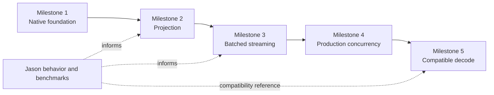

# SimdJson Wrapper Implementation Roadmap

<!-- covers: simd_json.package.documentation_layout -->

## Purpose

This document defines the milestones for building `SimdJson`, an Elixir wrapper around simdjson's On-Demand C++ API. It turns the architectural research into an ordered implementation plan with concrete outcomes and completion gates.

The roadmap is based on two research documents:

- [Designing a simdjson On-Demand NIF for Elixir / BEAM](../../.spec/research/simdjson_beam_nif_architecture.md)
- [Jason JSON Parser Architecture Analysis](../../.spec/research/jason_parser_architecture_analysis.md)

Each milestone also has a separate detailed implementation reference linked from its section below.

## Product thesis

`SimdJson` should not begin as a native reimplementation of `Jason.decode/1`.

Jason is already a highly optimized pure-Elixir parser for converting complete JSON documents into BEAM terms. It uses binary pattern matching, generated byte dispatch, explicit parser states, efficient list accumulation, and carefully chosen string-copy behavior. Competing only on eager decode speed would force `SimdJson` to pay the same unavoidable cost of constructing every map, list, key, and value on the BEAM.

simdjson offers a different opportunity:

```text
large JSON binary
       ↓
SIMD structural discovery
       ↓
On-Demand traversal
       ↓
only requested values cross into the BEAM
```

The library should therefore make projection and batched array processing its primary capabilities. Complete decoding is added later for compatibility and adoption.

## What the Jason findings change

The Jason analysis establishes a useful baseline for product and engineering decisions:

| Jason finding | Implication for `SimdJson` |
| --- | --- |
| Jason is implemented directly in Elixir rather than wrapping another parser. | Treat it as a strong BEAM-native reference implementation, not a naïve baseline. |
| Jason discovers structure and constructs terms in one parsing pass. | Benchmark complete workflows, including term allocation, rather than parser kernels alone. |
| Jason normally materializes the complete JSON value. | Focus early milestones on avoiding materialization through projection and streaming. |
| Jason supports copied and source-referencing string strategies. | Copy returned strings by default so tiny results do not retain enormous source binaries. |
| Jason uses an explicit parser stack. | Full decoding must use bounded, explicit traversal state rather than unbounded native recursion. |
| Jason constructs arrays and objects efficiently for the BEAM. | Treat its allocation behavior as a compatibility and performance reference in Milestone 5. |
| Jason's normal API crosses no native boundary. | Minimize NIF crossings by submitting whole projections and whole batches. |

The meaningful performance comparisons are:

```text
Jason.decode(json) + nested lookups
        versus
SimdJson.select(json, projection)
```

and:

```text
Jason.decode(json) + Enum processing
        versus
SimdJson.stream(json, projected batches)
```

An eager `Jason.decode/1` versus `SimdJson.decode/1` comparison remains useful in Milestone 5, but it is not the central measure of the library's value.

## Non-negotiable architecture rules

Every milestone must preserve these rules:

1. Potentially expensive parsing and traversal never run on a normal BEAM scheduler.
2. Native concurrency is bounded; no request creates an unbounded OS thread or dirty-scheduler backlog.
3. An On-Demand document retains or owns its input memory for its complete native lifetime.
4. Child cursors retain their parent document, preventing use-after-free.
5. Stateful cursors are single-owner and forward-only unless an API explicitly provides different semantics.
6. Arbitrary JSON keys never become atoms.
7. Returned strings are copied by default instead of retaining a large source binary.
8. Projections and batches cross the NIF boundary once per useful unit of work, not once per path segment or field.
9. C++ exceptions stop at a small C ABI and become stable Elixir error values.
10. Scheduler latency, memory, cancellation, and cleanup are correctness concerns, not optional optimizations.

## Milestone sequence



The milestones are deliberately sequential. Later work may begin experimentally, but no milestone is complete until the safety and ownership contracts from earlier milestones remain intact.

---

## Milestone 1 — Native Foundation and Opaque Document Resource

[Detailed implementation reference](01-native-foundation.md)

[Implementation and qualification operations](01-native-foundation-operations.md)

[Acceptance record](01-native-foundation-acceptance.md)

**Status:** Active on the qualified Ubuntu 24.04 x86-64 target.

### Goal

Establish a reproducible, scheduler-safe vertical slice from Elixir through Zigler and Zig to a tiny C ABI over simdjson C++.

At the end of this milestone, the library can safely open and close an opaque native document. It does not yet need to expose a broad traversal API.

### Main deliverables

- Reproducible native build with pinned Zig, Zigler, C++, and simdjson versions.
- Small C ABI exposing opaque handles, numeric status codes, and matching destructors.
- C++ exception containment at the ABI boundary.
- `SimdJson.Document` resource with parser, document, input, owner, generation, and lifecycle state.
- Safe padded input copy as the baseline buffer strategy.
- Verified off-scheduler execution for document opening.
- Minimal Elixir API:

  ```elixir
  {:ok, document} = SimdJson.open(json_binary)
  :ok = SimdJson.close(document)
  ```

- Stable `SimdJson.Error` representation for parsing, ownership, allocation, and lifecycle failures.
- Explicit close plus idempotent garbage-collection cleanup.
- Native unit tests and sanitizer coverage.

### Key design decisions

- How simdjson is acquired and pinned.
- Which provisional off-scheduler mechanism is used until Milestone 4 owns a full worker pool.
- Whether zero-copy input can be proven safe for any supported allocation path.
- Which platforms and CPU dispatch paths are supported initially.
- Whether attempted operations consume a document and how generations expose stale state.

### Completion gate

Milestone 1 is complete when valid JSON creates a safe opaque resource, invalid JSON returns structured errors, large opens do not block normal schedulers, and explicit or garbage-collected cleanup is free of leaks and use-after-free under native sanitizers.

---

## Milestone 2 — Projection with `SimdJson.select/2`

[Detailed implementation reference](02-projection-api.md)

### Goal

Deliver the library's flagship operation: extract several caller-selected scalar values in one guided native traversal and create only those values as BEAM terms.

### Main deliverables

- Projection grammar using caller-supplied result keys and paths containing binary field names and non-negative array indexes.
- Complete projection validation before traversal.
- Prefix-sharing native projection tree or equivalent compiled representation.
- One-pass traversal that follows document order without repeatedly rewinding the On-Demand cursor.
- Binary and open-document entry points:

  ```elixir
  {:ok, result} =
    SimdJson.select(json, [
      id: ["customer", "id"],
      name: ["customer", "name"],
      total: ["order", "total"]
    ])
  ```

- Scalar conversion for strings, integers, floats, booleans, and null.
- Fresh output binaries for selected strings.
- Structured missing-field, index, type, parse, ownership, closed, and consumed-cursor errors.
- Defined document-consumption behavior after successful and failed traversal.
- Projection benchmarks against Jason full decode followed by equivalent lookups.

### Jason-informed benchmark gate

The comparison must include Jason's complete successful workflow:

```text
decode complete document
        +
perform nested lookups
        +
retain and collect allocated BEAM terms
```

The `SimdJson` measurement must include structural scanning, projection compilation, traversal, native scheduling, and BEAM result construction. Parser-only microbenchmarks do not satisfy this gate.

### Completion gate

Milestone 2 is complete when one call extracts multiple paths, shared path prefixes are processed together, only selected values become BEAM terms, field declaration order is independent of JSON object order, and measured allocation is substantially lower than eager decoding for sparse projections.

---

## Milestone 3 — Batched Array Streaming

[Detailed implementation reference](03-batched-array-streaming.md)

### Goal

Process arrays containing millions of records through a lazy Elixir `Enumerable`, returning projected rows in bounded native batches rather than decoding the complete array or crossing the NIF boundary for every field.

### Main deliverables

- Lazy streaming API with target path, per-row projection, and bounded batch size:

  ```elixir
  SimdJson.stream(json,
    path: ["customers"],
    fields: [id: ["id"], email: ["contact", "email"]],
    batch_size: 1_000
  )
  ```

- Cursor resource retaining its parent document and input buffer.
- Single-process ownership and generation checks.
- Reuse of the Milestone 2 projection engine for every row.
- At most one active native batch and one batch being consumed per stream.
- Row-count and byte-oriented batch bounds.
- Deterministic cleanup through the enumerable lifecycle.
- Early halt without parsing the remainder of the array.
- Array-index-aware errors for failures after earlier batches were delivered.
- Cooperative cancellation checks between rows and conversion chunks.
- ETL benchmarks against Jason eager decode followed by equivalent `Enum` processing.

### Backpressure contract

The consumer controls native progress:

```text
consumer requests data
        ↓
native cursor produces one bounded batch
        ↓
BEAM consumes that batch
        ↓
only then may another batch begin
```

Milestone 3 does not prefetch multiple batches. Prefetch can be evaluated later only with strict bounds and explicit cancellation behavior.

### Completion gate

Milestone 3 is complete when a very large target array can be processed with bounded working memory, early termination releases native state promptly, only one batch is in flight, mid-stream errors clean up safely, and scheduler responsiveness remains acceptable under concurrent consumers.

---

## Milestone 4 — Worker Pool, Cancellation, Backpressure, and Telemetry

[Detailed implementation reference](04-worker-pool-and-operations.md)

### Goal

Replace provisional native execution with a production-ready, fixed-capacity subsystem whose queueing, cancellation, shutdown, and observability behavior are explicit.

### Main deliverables

- Fixed native worker count with conservative configuration bounds.
- Bounded non-blocking job queue.
- Owned job descriptors containing request reference, caller identity, operation type, retained resources, arguments, timing, and cancellation state.
- Immediate structured `:busy` error when admission capacity is exhausted.
- Unique request/reply correlation and safe late-reply handling.
- Caller monitoring and cooperative cancellation for queued and running work.
- Per-document and per-cursor serialization for state-advancing jobs.
- Safe cancellation/completion race handling with exactly one cleanup owner.
- Telemetry for queue time, execution time, conversion time, sizes, outcomes, cancellations, and rejections.
- Startup failure cleanup, queue draining, worker joining, NIF unload, and application shutdown behavior.
- Concurrency stress, race-detector, sanitizer, and scheduler-latency tests.

### Operational contract

The pool protects both kinds of BEAM scheduler:

- normal schedulers perform only short validation, admission, and result handling;
- dirty CPU schedulers do not become an implicit unbounded JSON pool;
- native workers execute the expensive simdjson operations;
- queue capacity creates visible backpressure before memory grows without bound.

Telemetry must never include raw JSON, selected values, or uncontrolled high-cardinality paths.

### Completion gate

Milestone 4 is complete when workers and queued jobs are always bounded, saturation cannot block normal schedulers, dead callers cancel unnecessary work, stateful resources cannot execute conflicting jobs, telemetry explains capacity and latency, and startup or shutdown cannot leak jobs, threads, resources, or NIF environments.

---

## Milestone 5 — Jason-Compatible Decode API

[Detailed implementation reference](05-compatible-decode-api.md)

### Goal

Add familiar eager decoding for adoption and interoperability while preserving all scheduler, ownership, atom-safety, concurrency, cancellation, and error guarantees established by the earlier milestones.

### Main deliverables

- Conventional decode API:

  ```elixir
  {:ok, value} = SimdJson.decode(json)
  value = SimdJson.decode!(json)
  ```

- Iterative full-tree materializer for objects, arrays, strings, numbers, booleans, and null.
- Explicit stack and maximum-depth handling rather than unbounded native recursion.
- Binary object keys by default with no arbitrary atom creation.
- Exact documented policy for signed, unsigned, floating-point, and larger-than-64-bit numbers.
- Correct UTF-8, escape, Unicode surrogate, duplicate-key, trailing-data, and top-level scalar behavior.
- Configured limits for input size, depth, individual values, and estimated result size where needed.
- `decode/2` tagged errors and `decode!/2` exceptions sharing one stable error representation.
- Bounded worker-pool execution, cancellation, and decode-specific telemetry.
- Published compatibility matrix against a pinned Jason version.
- Differential conformance tests and end-to-end performance comparisons with Jason.

### Compatibility policy

“Jason-compatible” means that supported behavior and intentional differences are documented and executable as tests. It does not mean copying every optional feature regardless of safety.

In particular:

- arbitrary JSON keys remain binaries;
- string reference behavior must not retain unexpectedly large inputs by default;
- exact error message text need not match when error categories and locations are stable;
- unsupported options return clear errors rather than being silently ignored;
- numeric values never succeed through silent precision loss.

### Completion gate

Milestone 5 is complete when the decoder materializes every JSON type, matches the published compatibility matrix, handles deep and large inputs within documented limits, cleans up partial trees after failure or cancellation, and has honest end-to-end benchmarks covering term allocation, garbage collection, queue delay, and scheduler latency.

---

## Cross-milestone verification program

Every milestone expands one shared verification program.

### Correctness

- JSON conformance corpus.
- Differential tests against a pinned Jason version where behavior overlaps.
- Property tests for valid generated documents and malformed mutations.
- Ownership, closed-resource, stale-generation, and process-death cases.
- Native failure injection and error translation.

### Native safety

- Address and undefined-behavior sanitizers.
- Leak checks around explicit close, garbage collection, cancellation, and shutdown.
- Race detection for worker, cursor, cancellation, and close transitions.
- Guard-page or equivalent validation before any zero-copy input path is enabled.

### BEAM safety

- Normal and dirty scheduler utilization.
- p50, p95, and p99 scheduler wake-up latency.
- Process heap, binary memory, native memory, and garbage-collection time.
- Mailbox behavior for completed, timed-out, and abandoned jobs.
- Repeated application start, stop, and code-loading scenarios.

### Performance

Maintain three benchmark families throughout development:

1. Full materialization: Jason decode versus `SimdJson.decode` when Milestone 5 exists.
2. Sparse projection: Jason decode plus lookups versus `SimdJson.select`.
3. Array ETL: Jason decode plus enumeration versus `SimdJson.stream`.

Report complete workflows with warmup, input corpus, hardware, CPU features, dependency versions, concurrency, memory, and percentile latency. Throughput without scheduler and memory measurements is insufficient for a BEAM library.

## Release gates

| Milestone | Suggested release posture | User-visible proof |
| --- | --- | --- |
| 1 | Internal/native preview | Safe open/close and reproducible native builds. |
| 2 | Projection alpha | Multiple fields extracted with minimal BEAM allocation. |
| 3 | Streaming beta | Bounded-memory array ETL through an Enumerable. |
| 4 | Production candidate | Bounded concurrency, cancellation, telemetry, and safe shutdown. |
| 5 | Compatibility release | Documented Jason-compatible eager decode plus differentiated projection and streaming APIs. |

These labels describe readiness, not required semantic-version numbers.

## Explicit non-goals for the initial roadmap

The first five milestones do not require:

- a JSON encoder;
- arbitrary JSONPath, recursive descent, or filters;
- one NIF call per cursor step or nested access operator;
- automatic conversion of JSON keys to atoms;
- unbounded native threads or queue capacity;
- multi-batch prefetch;
- shared mutable cursors across processes;
- unverified zero-copy access to ordinary BEAM binary memory;
- exact replacement of every Jason option;
- parallel parsing of one On-Demand cursor.

These features can be evaluated after the core projection, streaming, operational, and compatibility contracts have been measured in real applications.

## Final definition of success

The wrapper is successful when it gives Elixir applications a safe capability that Jason does not aim to provide:

```text
very large JSON
      ↓
bounded native work
      ↓
On-Demand projection or batched traversal
      ↓
minimal, intentional BEAM allocation
```

Eager decoding remains valuable, but the library's identity is the ability to avoid constructing data the application never requested while respecting BEAM scheduling, ownership, memory, and failure semantics.
